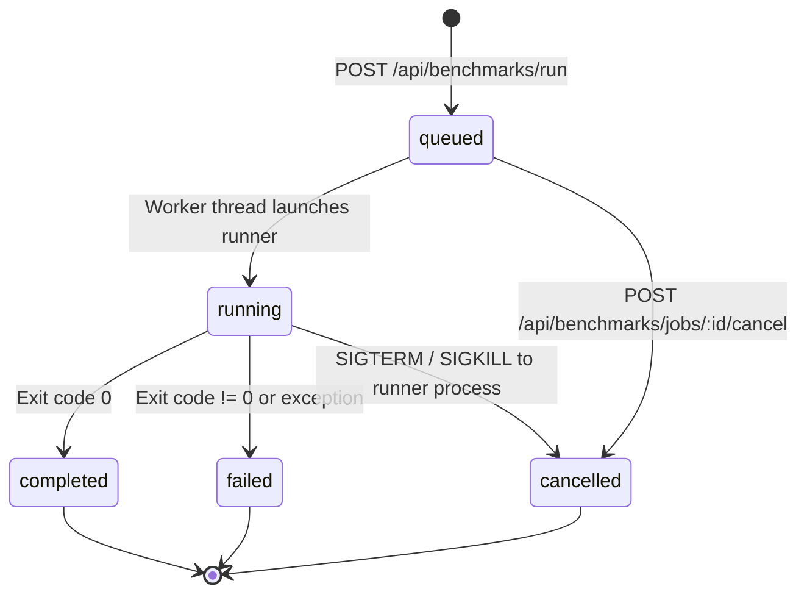

# CC2 Virtualization Lab Backend API Specification

## 1. Overview & Architecture

The **CC2 Benchmark API** is a secure, lightweight REST service built to mediate between the web dashboard and the underlying benchmark automation subsystem.

```text
Browser / Web Dashboard (Port 5173 / 4173)
           ↓ (JSON REST Requests / Whitelisted Schema)
     Backend API (Port 8000)
           ↓ (Job Manager & Single-Experiment Mutex)
     benchmark/runner.py
           ↓ (Environment Adapters)
[Host]   [KVM/QEMU]   [VirtualBox]   [Native LXC]
           ↓
   results/ (Raw & Processed Datasets)
```

### Key Security Invariants:
- **Zero Arbitrary Execution**: The API only accepts strictly whitelisted parameter fields (`environment`, `benchmark`, `mode`, `runs`). Any shell operators, client-supplied command strings, or arbitrary file paths are rejected immediately with HTTP 400.
- **Log & Payload Sanitization**: Passwords, SSH private keys, tokens, and authorization headers are scrubbed using regular expression filters before being written to logs or emitted in HTTP responses.
- **Concurrency Mutex**: To guarantee uncompromised performance measurements and avoid host CPU/IO interference, only one active experiment job may run at a time. Conflicting requests receive HTTP 409 Conflict.
- **Non-Destructive Guarantee**: Benchmark retrieval endpoints (`GET`) strictly read persisted JSON datasets and never trigger benchmark workloads.

---

## 2. API Endpoints Reference

### 2.1 Health Check
- **Endpoint**: `GET /api/benchmarks/health`
- **Description**: Returns overall service status and discovered environment classifications.
- **Response**: `200 OK`
```json
{
  "status": "healthy",
  "timestamp": "2026-09-17T01:00:00.000000+00:00",
  "service": "cc2-benchmark-api",
  "version": "1.0.0",
  "environments": {
    "host": {
      "name": "host",
      "display_name": "Bare-Metal Host Baseline",
      "classification": "Reference Overhead Baseline",
      "status": "available"
    },
    "kvm": {
      "name": "kvm",
      "display_name": "KVM / QEMU",
      "classification": "kernel-based hardware virtualization / Type-1-like",
      "status": "available"
    },
    "virtualbox": {
      "name": "virtualbox",
      "display_name": "Oracle VM VirtualBox",
      "classification": "Type-2 hosted hypervisor",
      "status": "available"
    },
    "lxc": {
      "name": "lxc",
      "display_name": "Native Linux Containers (LXC)",
      "classification": "Linux OS-level virtualization / containerization",
      "status": "available"
    }
  }
}
```

---

### 2.2 Start Benchmark Job
- **Endpoint**: `POST /api/benchmarks/run`
- **Description**: Submits an asynchronous benchmark experiment job.
- **Request Body**:
```json
{
  "environment": "host",
  "benchmark": "cpu",
  "mode": "quick",
  "runs": 2
}
```
  - `environment`: One of `"host"`, `"kvm"`, `"virtualbox"`, `"lxc"`, `"all"`.
  - `benchmark`: One of `"cpu"`, `"memory"`, `"disk"`, `"network"`, `"startup"`, `"syscall"`, `"scheduling"`, `"isolation"`, `"all"`.
  - `mode`: `"quick"` (1 warmup, 2 measured runs) or `"full"` (1 warmup, 5 measured runs).
  - `runs`: Optional integer between `1` and `20`.
- **Responses**:
  - `202 Accepted`: Job successfully enqueued.
    ```json
    {
      "job_id": "job-20260917-010000-abcdef12",
      "status": "queued",
      "environment": "host",
      "benchmark": "cpu_deterministic",
      "mode": "quick",
      "runs": 2,
      "created_at": "2026-09-17T01:00:00.000000+00:00",
      "progress": {
        "status": "queued",
        "phase": "queued",
        "percent": 0
      }
    }
    ```
  - `400 Bad Request`: Validation failure (unknown environment, benchmark, or invalid run count).
  - `409 Conflict`: Another experiment job is currently active.

---

### 2.3 List Jobs
- **Endpoint**: `GET /api/benchmarks/jobs`
- **Description**: Returns recent benchmark jobs sorted from newest to oldest.
- **Response**: `200 OK`
```json
{
  "count": 1,
  "jobs": [
    {
      "job_id": "job-20260917-010000-abcdef12",
      "status": "completed",
      "environment": "host",
      "benchmark": "cpu_deterministic",
      "mode": "quick",
      "runs": 2,
      "created_at": "2026-09-17T01:00:00.000000+00:00",
      "started_at": "2026-09-17T01:00:01.000000+00:00",
      "ended_at": "2026-09-17T01:00:15.000000+00:00",
      "exit_code": 0
    }
  ]
}
```

---

### 2.4 Get Job Details & Progress
- **Endpoint**: `GET /api/benchmarks/jobs/:id`
- **Description**: Returns execution details, real-time progress metrics, and linked result files.
- **Response**: `200 OK`
```json
{
  "job_id": "job-20260917-010000-abcdef12",
  "status": "running",
  "environment": "host",
  "benchmark": "memory_deterministic",
  "progress": {
    "status": "running",
    "environment": "host",
    "benchmark": "memory_deterministic",
    "run": 2,
    "total_runs": 5,
    "phase": "executing_runs",
    "percent": 40
  },
  "result_files": []
}
```
- **Error**: `404 Not Found` if the job ID is unknown.

---

### 2.5 Get Job Execution Logs
- **Endpoint**: `GET /api/benchmarks/jobs/:id/logs`
- **Description**: Returns real-time or historical execution logs with passwords and private keys redacted.
- **Response**: `200 OK`
```json
{
  "job_id": "job-20260917-010000-abcdef12",
  "status": "completed",
  "stdout": "[*] Step 1/7: Preparing environment 'host'...\n...",
  "stderr": "",
  "sanitized": true
}
```

---

### 2.6 Benchmark Results Retrieval
- **Endpoint**: `GET /api/benchmarks/results`
- **Description**: Returns processed results dataset with statistical distributions and provenance `raw_run_ids`.
- **Response**: `200 OK`

- **Endpoint**: `GET /api/benchmarks/results/:environment/:benchmark`
- **Description**: Returns results filtered to a specific environment and benchmark domain.
- **Response**: `200 OK`

---

### 2.7 Multi-Environment Summary
- **Endpoint**: `GET /api/benchmarks/summary`
- **Description**: Returns the processed descriptive summary across all four virtualization tiers.
- **Invariant**: Strictly non-evaluative; zero `winner`, `best`, `worst`, `ranking`, or `score` fields.
- **Response**: `200 OK`

---

## 3. Job Lifecycle & State Transitions



---

## 4. Running the API Server

```bash
# Launch server on default localhost:8000
./backend/run_server.sh

# Or launch with custom host/port
./backend/run_server.sh 127.0.0.1 8000
```
