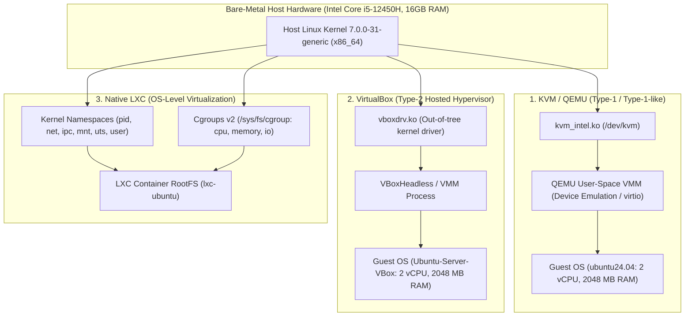

# CC2 Platform Architecture & Virtualization Engineering

## Executive Summary

The **CC2 Comparative Benchmarking Platform** is an empirical, non-destructive systems evaluation framework designed to quantify and compare performance characteristics across three distinct virtualization paradigms on an identical Ubuntu host:

1. **KVM / QEMU**: **kernel-based hardware virtualization / commonly classified as Type-1 or Type-1-like** (utilizing the host Linux kernel via `kvm.ko` and hardware assist; not a standalone GRUB-launched hypervisor like Xen)
2. **VirtualBox**: **Type-2 hosted hypervisor**
3. **Native LXC**: **Linux OS-level virtualization/containerization**



---

## 1. Virtualization Technology Classifications

### 1.1 KVM (Kernel-based Virtual Machine) & QEMU
- **Taxonomy**: Kernel-integrated hardware virtualization, widely classified as **Type-1 / Type-1-like**.
- **Architectural Mechanics**:
  - KVM converts the standard Linux host kernel into a bare-metal hypervisor via kernel modules (`kvm.ko` and processor-specific `kvm_intel.ko` or `kvm_amd.ko`).
  - Leveraging Intel VT-x hardware-assisted extensions, guest vCPUs execute directly on physical CPU cores in **VMX non-root mode**, while the host kernel executes in **VMX root mode**.
  - CPU scheduling and physical memory allocation are handled directly by the host Linux kernel scheduler (CFS / EEVDF) and memory manager.
- **QEMU (Quick Emulator)**:
  - Operates as a user-space process acting as the **Virtual Machine Monitor (VMM)** and platform emulator.
  - Interacts with `/dev/kvm` via `ioctl` interfaces (`KVM_CREATE_VM`, `KVM_RUN`).
  - Implements paravirtualized I/O devices via **virtio** (virtio-blk, virtio-net), drastically reducing VM-exit overhead compared to pure device emulation.

### 1.2 VirtualBox (Oracle VM VirtualBox)
- **Taxonomy**: Classic **Type-2 hosted hypervisor**.
- **Architectural Mechanics**:
  - VirtualBox runs strictly as an application space process atop a host operating system.
  - Relies on out-of-tree loadable kernel modules (`vboxdrv`, `vboxnetflt`, `vboxnetadp`) to switch CPU states into hardware virtualization mode.
  - Intercepts privileged instructions, interrupts, and guest memory operations through its proprietary Virtual Machine Monitor (VMM).
  - While capable of hardware-assisted execution via VT-x, execution control and memory management must constantly bridge across multiple abstraction boundaries: Host Kernel $\leftrightarrow$ `vboxdrv` driver $\leftrightarrow$ VirtualBox VMM process $\leftrightarrow$ Guest OS.

### 1.3 Native Linux LXC (LinuX Containers)
- **Taxonomy**: **Operating system-level virtualization / containerization**.
- **Architectural Mechanics**:
  - Pure isolation without a hypervisor, without hardware emulation, and without a second kernel.
  - Guest processes share the identical host Linux kernel and execute directly on bare metal instructions.
  - **Isolation Primitives**:
    - **Namespaces**: Isolates system views including process trees (`pid`), network devices and routing tables (`net`), mount hierarchies (`mnt`), IPC message queues (`ipc`), system identity (`uts`), and user mappings (`user`).
    - **Control Groups (cgroups v2)**: Enforces precise resource limits and accounting on CPU quotas (`cpu.max`), memory allocations (`memory.max`), and I/O bandwidth (`io.max`).
  - Zero virtualization trap overhead (no VM-exits, no nested page table walks, no hypervisor context switches).

---

## 2. Theoretical Comparison Matrix

| Dimension | KVM / QEMU | VirtualBox | Native LXC |
|:---|:---|:---|:---|
| **Hypervisor Type** | Type-1 / Type-1-like (Kernel-integrated) | Type-2 (Hosted Hypervisor) | None (OS-level containerization) |
| **Kernel Instances** | Independent Guest Kernel | Independent Guest Kernel | Shared Host Kernel |
| **CPU Execution Mode** | VT-x VMX Non-Root Mode | VT-x via `vboxdrv` VMM | Direct Host User-Mode |
| **Memory Management** | EPT / Nested Page Tables (NPT) | Nested Paging / Shadow Page Tables | Native Host MMU (Zero translation overhead) |
| **I/O Device Model** | Paravirtualized `virtio` + Emulation | Emulated PCI/SATA/IDE + Guest Additions | Direct Host Syscalls / VFS Virtualization |
| **Networking Path** | Linux Bridge (`virbr0`) + TAP device | NAT Engine or Host-Only Adapter | Linux Bridge (`lxcbr0`) + `veth` pair |
| **Startup Overhead** | Seconds (Full OS boot cycle) | Seconds to Tens of Seconds | Sub-second (Process spawn) |
| **Security Boundary** | Hardware memory isolation (VMX/EPT) | Hardware isolation + VMM sandbox | Kernel namespace boundary |

---

## 3. Platform Software Architecture

The CC2 codebase is organized into isolated, single-responsibility modules:

```text
cc2/
├── benchmark/        # Orchestration layer, environment state probes, execution drivers
├── workloads/        # Deterministic C/C++ CPU and memory compute kernels + Makefile
├── collector/        # Safe system introspection, hardware discovery, common schemas
├── analysis/         # Statistical analysis engine, checksum verification, anti-fabrication validator
├── results/          # Machine-readable inventory and traceable execution logs (.json, .jsonl)
├── dashboard/        # Interactive React + TypeScript + Vite web visualization application
├── docs/             # Technical specifications, safety protocols, and experiment plans
├── tests/            # Automated non-destructive unit and integration test suite
└── README.md         # Top-level operational guide and quickstart
```

### 3.1 Workload Layer (`workloads/`)
- Written in standard C (`c99`, `-O2 -pthread -lm`).
- **`cpu_workload.c`**:
  - Deterministic $O(N^3)$ double-precision matrix multiplication and polynomial operations.
  - Generates verifiable, deterministic FNV-1a checksum of the result buffer.
  - Measures high-resolution duration via `clock_gettime(CLOCK_MONOTONIC)` and computes true GFLOPS.
- **`memory_workload.c`**:
  - High-throughput sequential read/write passes across allocated buffers (e.g. 32MB–512MB).
  - Emits true measured throughput in MB/s along with memory checksum.

### 3.2 Collection & Provenance Layer (`collector/` & `results/`)
- Employs `collector/common.py` providing:
  - `SafetyValidator`: Regex-based rejection engine blocking all destructive disk, partition, and VM-deletion commands.
  - `BenchmarkResult`: Canonical dataclass holding execution provenance:
    ```json
    {
      "environment": "host|kvm|virtualbox|lxc",
      "benchmark": "cpu_deterministic|memory_deterministic",
      "run_id": "<uuid>",
      "timestamp": "<iso8601>",
      "command": "<exact shell string>",
      "exit_code": 0,
      "stdout": "<raw stdout>",
      "stderr": "<raw stderr>",
      "parsed_metrics": {},
      "status": "success|failed|unavailable"
    }
    ```
  - **Rule**: If an environment is unavailable or offline, it is flagged as `status: unavailable`. Missing measurements are NEVER populated with 0.

### 3.3 Statistical & Validation Engine (`analysis/`)
- **`stats.py`**: Computes mean, median, standard deviation, min, max, and verifies checksum uniformity across repeated runs.
- **`validator.py`**: Verifies 100% provenance. Rejects any record containing metrics that cannot be traced character-for-character to the raw `stdout`.

### 3.4 Visualization Dashboard (`dashboard/`)
- Built with **React 18 + TypeScript + Vite**.
- Directly loads real discovery and run data from `results/`.
- Features real-time environment status monitoring, hardware introspection tables, and an interactive Execution Provenance Modal allowing drilldown into raw commands, timestamps, and stdout.
