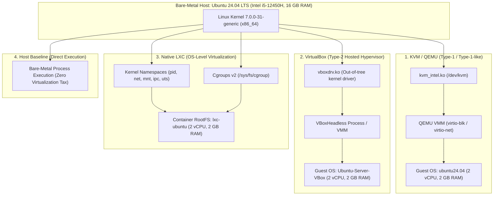
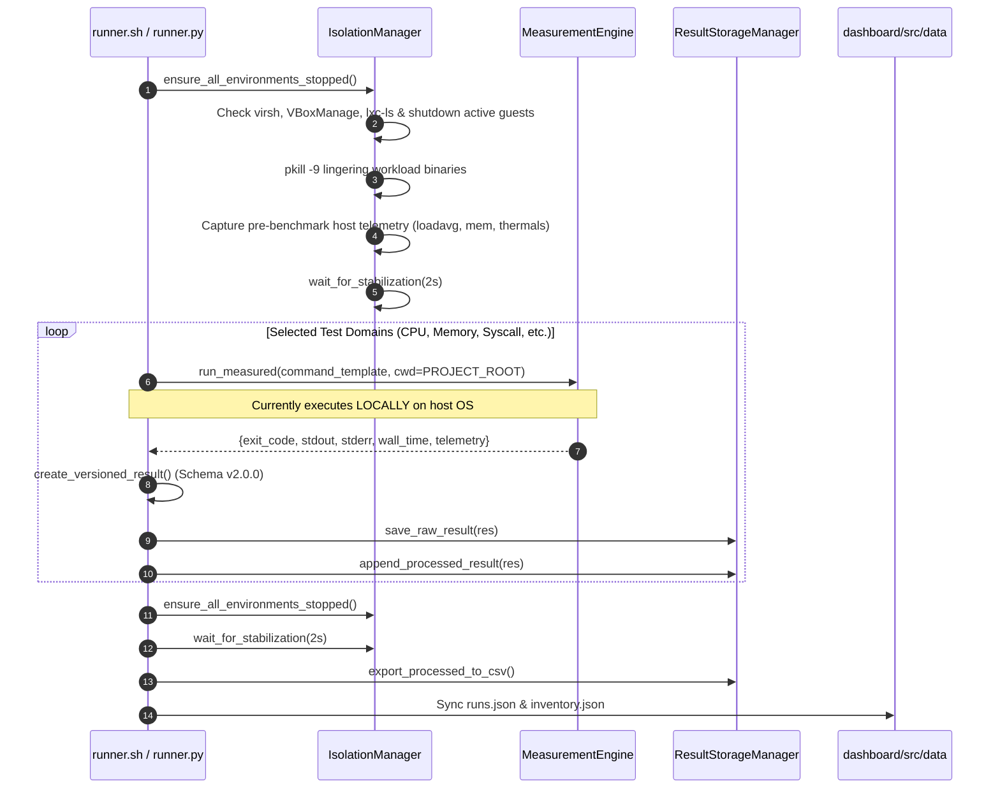
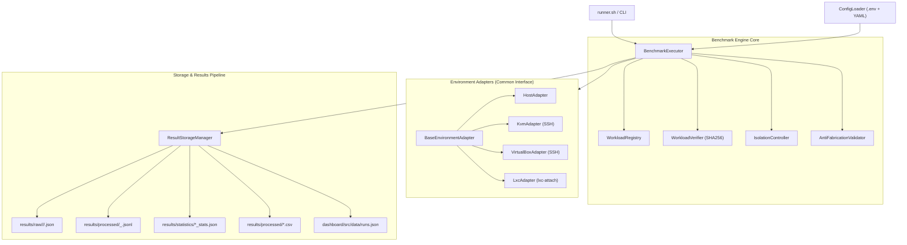
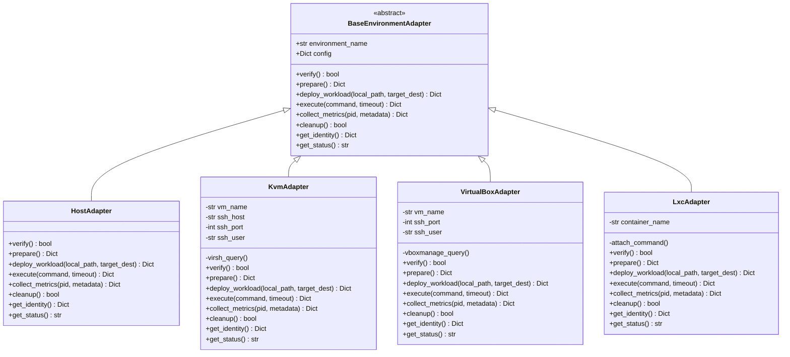
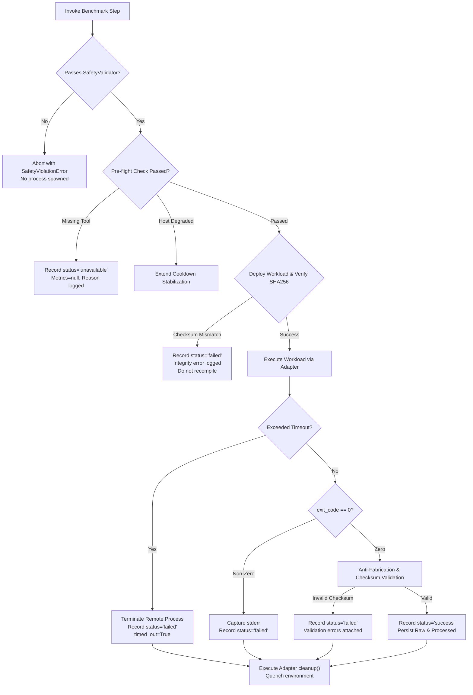
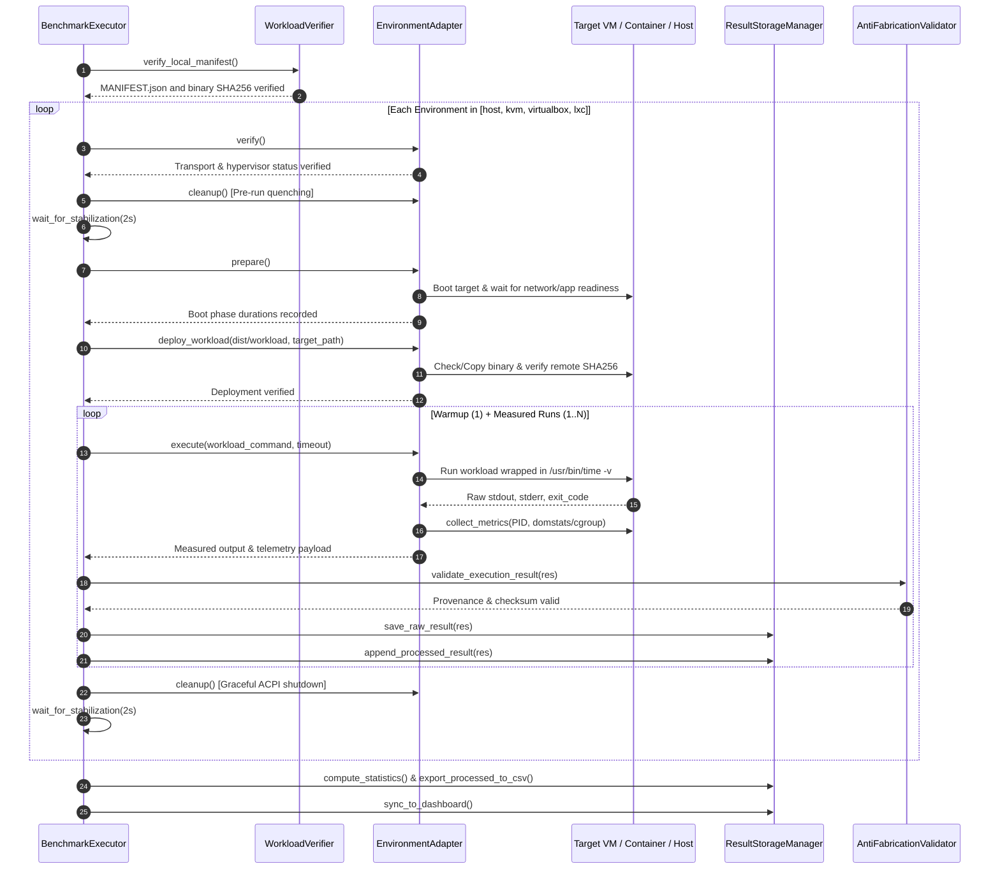
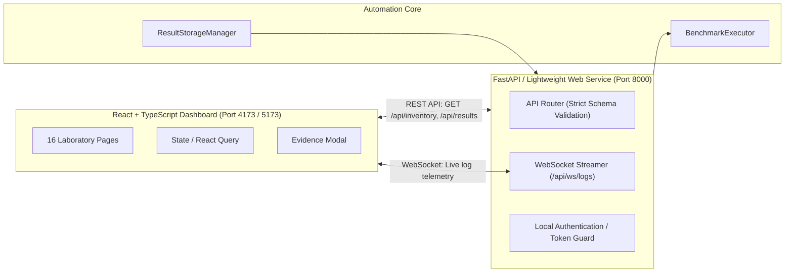
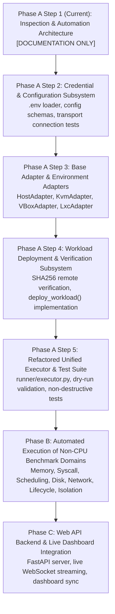

# CC2 Automation Architecture & Design Specification

## Executive Summary & System Taxonomy

The **CC2 Comparative Virtualization Benchmarking Platform** is an empirical, non-destructive systems evaluation suite designed to quantify and compare performance, resource utilization, and isolation boundaries across four execution tiers on an Ubuntu Linux host:

1. **Host Baseline**: Direct bare-metal execution on Ubuntu 24.04 LTS (overhead reference).
2. **KVM / QEMU**: Kernel-based hardware virtualization, classified as **Type-1 / Type-1-like**. The host Linux kernel acts directly as the hypervisor via `kvm_intel.ko` utilizing Intel VT-x hardware extensions in VMX non-root mode, with user-space QEMU providing VMM device emulation.
3. **Oracle VM VirtualBox**: Hosted hypervisor (**Type-2**). Executes as a user-space application relying on out-of-tree host kernel modules (`vboxdrv.ko`) to mediate guest CPU execution and hardware traps.
4. **Native LXC (Linux Containers)**: Linux **OS-level virtualization / containerization**. Shares the host Linux kernel directly with zero hypervisor mediation, using kernel namespaces (`pid`, `net`, `mnt`, `ipc`, `uts`, `user`, `cgroup`) and unified cgroups v2 (`/sys/fs/cgroup`) for resource containment.



> [!IMPORTANT]
> **Core Architectural Boundaries**:
> - **No Docker / No LXD**: Native upstream LXC (`5.0.3`) is strictly utilized.
> - **No Xen**: KVM/QEMU is the sole kernel-integrated hardware virtualization platform.
> - **No Synthetic / Mock Data**: Missing metrics are explicitly preserved as `null` with `status: "unavailable"`. Zero values are never substituted for missing measurements.
> - **Non-Destructive Guarantee**: Windows partitions (`nvme0n1p3`, `nvme0n1p4`) and EFI system partitions (`nvme0n1p1`) must never be modified, mounted read-write, or repartitioned.

---

## A. Project Inventory

A thorough audit of the existing codebase at `/home/karthik-chakala/Downloads/CC2` reveals the following modules and assets:

```text
CC2/
├── benchmark/                        # Orchestration layer, adapters, and runner scripts
│   ├── driver.py                     # Legacy driver for host baseline and LXC benchmarks
│   ├── runner.py                     # Unified experiment runner (CLI, isolation, telemetry)
│   ├── runner.sh                     # Bash entry point forwarding CLI arguments to runner.py
│   ├── kvm_adapter.py                # KVM/QEMU discovery, lifecycle, and telemetry adapter
│   ├── vbox_adapter.py               # VirtualBox discovery, lifecycle, and telemetry adapter
│   ├── lxc_adapter.py                # Native LXC discovery, lifecycle, cgroups v2 adapter
│   └── validate_environment.sh       # Pre-flight environment and dependency sanity checks
├── collector/                        # Host introspection, safety guards, and telemetry engines
│   ├── common.py                     # SafetyValidator, statuses, environments, safe subprocess wrapper
│   ├── inventory_collector.py        # Automated host hardware and hypervisor discovery
│   ├── measurement.py                # High-fidelity /usr/bin/time -v and perf measurement engine
│   ├── schema.py                     # VersionedBenchmarkResult (v2.0.0), ResultStorageManager
│   ├── advanced_metrics.py           # strace, pidstat, perf stat, thermal, and HTTP latency collectors
│   └── env_discovery.sh              # Discovery shell runner
├── workloads/                        # Deterministic C compute kernels and packaging system
│   ├── src/                          # C source files
│   │   ├── common_workload.h         # Timing macros, FNV-1a 64-bit checksum, optimization barrier
│   │   ├── cpu_workload.c            # Deterministic double-precision matrix multiplication
│   │   ├── memory_workload.c         # Sequential, sweep, and strided memory benchmark
│   │   ├── syscall_workload.c        # Raw getpid() system call latency benchmark
│   │   ├── scheduling_workload.c     # 2-way pipe ping-pong context-switch benchmark
│   │   └── http_health_app.py        # Minimal HTTP /health server for latency testing
│   ├── dist/                         # Statically compiled binary executables
│   │   ├── cpu_workload              # Statically linked ELF binary (SHA256: 21285303...63fd9f)
│   │   ├── memory_workload           # Statically linked ELF binary
│   │   ├── syscall_workload          # Statically linked ELF binary
│   │   ├── scheduling_workload       # Statically linked ELF binary
│   │   ├── run_workload.sh           # Standardized POSIX wrapper script
│   │   └── http_health_app.py        # Python HTTP health app
│   ├── Makefile                      # Static compilation target (gcc -static -O2 -pthread)
│   ├── MANIFEST.json                 # Workload package manifest with SHA256 hashes
│   └── build_package.py              # Manifest generator computing SHA256 and compiler flags
├── analysis/                         # Statistical aggregation and anti-fabrication validator
│   ├── statistics_engine.py          # mean, median (p50), stdev, % CV, p95, p99 (zero-coercion protection)
│   ├── analyze.py                    # Top-level results aggregator producing report_summary.json
│   ├── validator.py                  # Provenance and anti-fabrication validator
│   └── stats.py                      # Legacy statistics module
├── results/                          # Data persistence repository
│   ├── host_inventory.json           # Live hardware, kernel, network, and hypervisor discovery snapshot
│   ├── raw/                          # Raw execution payloads
│   │   ├── host/                     # Subdirectories per benchmark domain
│   │   ├── kvm/                      # Subdirectories per benchmark domain
│   │   ├── virtualbox/               # Subdirectories per benchmark domain
│   │   ├── lxc/                      # Subdirectories per benchmark domain
│   │   └── *.json                    # 213 flat fallback JSON records for backward compatibility
│   ├── processed/                    # Per-domain JSONL streams, global runs.json, runs.csv
│   ├── statistics/                   # 40 per-domain statistical summaries (*_stats.json)
│   ├── report_summary.json           # High-level executive synthesis
│   └── benchmark_runs.jsonl          # Legacy append-only log
├── dashboard/                        # Interactive React + TypeScript + Vite visualization UI
│   ├── src/                          # 16-page virtualization laboratory components
│   ├── src/data/runs.json            # Ingested benchmark runs dataset
│   ├── src/data/inventory.json       # Ingested host inventory dataset
│   ├── package.json                  # Dependencies (React 19, Recharts, Lucide, Vite)
│   └── vite.config.ts                # Vite bundler configuration
├── docs/                             # Comprehensive technical specifications (18 documents)
│   ├── HOST_INVENTORY.md             # Discovered hardware and virtualization specifications
│   ├── ARCHITECTURE.md               # Platform architecture and isolation theory
│   ├── SAFETY.md                     # Non-destructive safety boundaries and guardrails
│   ├── EXPERIMENT_PLAN.md            # Scientific protocol, identical parameters, and roadmap
│   ├── FINAL_RESULTS.md              # Empirical measurements and comparative tables
│   ├── METHODOLOGY.md                # Scientific experimental design and statistical formulations
│   ├── REPRODUCIBILITY.md            # Step-by-step reproduction guide
│   ├── LIMITATIONS.md                # Constraints (Alder Lake scheduling, perf paranoid levels)
│   ├── EXPERIMENTAL_VALIDATION.md    # Quality assurance audit and determinism verification
│   ├── ADVANCED_METRICS.md           # Profiling specifications (strace, pidstat, thermal)
│   ├── DASHBOARD.md                  # 16-page React/TypeScript laboratory dashboard guide
│   ├── RESULT_SCHEMA.md              # Result schema (v2.0.0) specification
│   ├── RUNNER.md                     # Runner CLI usage and isolation protocol
│   ├── KVM.md                        # KVM/QEMU adapter specification
│   ├── VIRTUALBOX.md                 # VirtualBox adapter specification
│   ├── LXC.md                        # Native LXC adapter specification
│   └── WORKLOADS.md                  # Workload design, mathematical models, and parameters
├── tests/                            # Automated non-destructive unit and integration test suite
│   ├── test_structure.py             # Verifies directory layout and key files
│   ├── test_safety.py                # Verifies rejection of dangerous disk commands
│   ├── test_cpu_workload.py          # Verifies CPU workload determinism and checksums
│   ├── test_memory_workload.py       # Verifies memory workload determinism and throughput
│   ├── test_measurement_parser.py    # Verifies /usr/bin/time -v and perf telemetry parsing
│   ├── test_statistics.py            # Verifies statistical calculations and missing-data rules
│   ├── test_manifest.py              # Verifies package manifest and SHA256 integrity
│   ├── test_collector.py             # Verifies host inventory discovery integrity
│   ├── test_result_schema.py         # Verifies schema v2.0.0 and provenance rules
│   ├── test_invalid_output.py        # Verifies handling of malformed and non-zero exits
│   ├── test_kvm_adapter.py           # Unit tests for KVM discovery and domstats parsing
│   ├── test_vbox_adapter.py          # Unit tests for VirtualBox discovery and metrics
│   ├── test_lxc_adapter.py           # Unit tests for LXC discovery and cgroups v2
│   ├── test_runner.py                # Unit tests for CLI arguments, isolation, and export
│   ├── test_advanced_metrics.py      # Unit tests for strace, pidstat, thermal collectors
│   └── run_all_tests.sh              # Master test runner (15 test suites, 100% pass rate)
└── README.md                         # Project overview and operational guide
```

---

## B. Current Implementation Status

### 1. What is Implemented and Working
- **Deterministic Workloads**: The C workloads (`cpu_workload`, `memory_workload`, `syscall_workload`, `scheduling_workload`) compile statically (`-static`) with `-O2 -Wall -Wextra -pthread -std=c99 -fno-omit-frame-pointer`. They emit structured JSON containing 64-bit FNV-1a checksums and high-precision monotonic timing.
- **Packaging & Binary Parity**: `workloads/build_package.py` and `workloads/MANIFEST.json` verify SHA256 checksums before packaging. The canonical `cpu_workload` binary SHA256 is verified as `212853035b582f238058b8d436fecf1f25bd5ff249965c7467336903a563fd9f`.
- **System Telemetry & Measurement Engine**: `collector/measurement.py` executes commands with GNU `/usr/bin/time -v` and `perf stat`, parsing wall time, user time, system time, CPU %, context switches, page faults, and RSS. It inspects `/proc/sys/kernel/perf_event_paranoid` to report hardware counter availability accurately.
- **Safety Interceptor**: `collector/common.py:SafetyValidator` blocks dangerous commands (`mkfs`, `fdisk`, `parted`, `dd of=/dev/...`, `virsh undefine`, `lxc-destroy`, direct writes to `/dev/*`).
- **Result Schema & Persistence**: `collector/schema.py` implements schema version `2.0.0`, storing raw results in `results/raw/<env>/<benchmark>/<run_id>.json`, processed JSONL streams in `results/processed/`, and summary statistics in `results/statistics/`.
- **Statistical Aggregation**: `analysis/statistics_engine.py` computes mean, median (p50), sample standard deviation, % CV, p95, and p99, strictly excluding missing values without coercing them to zero.
- **Anti-Fabrication Validation**: `analysis/validator.py` checks that reported numbers originate character-for-character from raw standard output.
- **Environment Discovery**: Live introspection queries libvirt domains (`ubuntu24.04`), VirtualBox VMs (`Ubuntu-Server-VBox`), and LXC containers (`lxc-ubuntu`).
- **Test Infrastructure**: 15 comprehensive unit and integration test suites in `tests/` pass with zero failures.
- **Manual Benchmark Baseline**: Five valid runs of the canonical CPU benchmark across all four environments (Host, KVM, VirtualBox, LXC) are already completed and persisted in the repository.

### 2. Missing Capabilities & Identified Architectural Gaps
- **Lack of Unified Adapter Interface**: Although `kvm_adapter.py`, `vbox_adapter.py`, and `lxc_adapter.py` exist, they have disparate class architectures (`KvmLifecycle`, `VBoxWorkloadRunner`, `LxcDiscovery`). There is no common abstract base class enforcing standard lifecycle methods (`verify()`, `prepare()`, `deploy_workload()`, `execute()`, `collect_metrics()`, `cleanup()`, `get_identity()`, `get_status()`).
- **Missing Dedicated Host Adapter**: Host baseline execution logic is embedded ad-hoc inside `benchmark/runner.py` and `benchmark/driver.py`.
- **Remote / Guest Execution Dispatch**: In `benchmark/runner.py`, `run_benchmark_iterations()` executes commands directly on the host using `self.measurement.run_measured(command_template)` rather than dispatching into the target VM or container. Automated benchmarking requires:
  - Non-interactive SSH execution for KVM (`ubuntu24.04`) and VirtualBox (`Ubuntu-Server-VBox`).
  - Native `lxc-attach` execution for LXC (`lxc-ubuntu`).
- **Automated Workload Deployment & Verification**: No mechanism currently deploys the static workload binary into the guest/container, checks that the remote SHA256 matches `workloads/MANIFEST.json`, and sets permissions prior to test execution.
- **Centralized Credential & Configuration Subsystem**: No `.env` loader or structured configuration file exists. IP addresses, ports, and credentials are ad-hoc or partially discovered.
- **Live Web Dashboard API**: The dashboard is currently static, reading JSON snapshots compiled into `dashboard/src/data/`. There is no REST or WebSocket backend to trigger runs, report live progress, or inspect live execution logs.

---

## C. Existing Benchmark Workflow

The current benchmark execution workflow proceeds as follows:



### Limitations of the Existing Workflow
1. **Local Host Execution Trap**: For guest environments (KVM, VirtualBox, LXC), `runner.py` runs the command on the host while reading the target's host-side hypervisor process metrics (e.g. QEMU PID or cgroup memory). It does not dispatch the binary into the guest filesystem for true in-guest execution.
2. **Manual CPU Benchmark Separation**: The user manually ran five valid runs of the canonical CPU workload inside Host, KVM, VirtualBox, and LXC. These valid results must be safeguarded and never overwritten.
3. **Hard-coded Parameters**: Workload parameters (`--size 200` in runner.py vs canonical `--size 400` in the experiment plan) are hardcoded in test methods.

---

## D. Proposed Automated Architecture

The proposed automation architecture introduces a clean modular hierarchy separating configuration, orchestration, environment abstraction, workload management, telemetry, and storage:

```text
benchmark/
├── runner.sh                         # Master CLI entry point script
├── runner/                           # Modular Python automation package
│   ├── __init__.py
│   ├── config.py                     # Configuration loader (.env and YAML/dict config)
│   ├── executor.py                   # Central benchmark execution orchestrator
│   ├── environments/                 # Environment adapter implementations
│   │   ├── __init__.py
│   │   ├── base.py                   # Common abstract base class (EnvironmentAdapter)
│   │   ├── host.py                   # HostAdapter (bare-metal baseline)
│   │   ├── kvm.py                    # KvmAdapter (libvirt + SSH transport)
│   │   ├── virtualbox.py             # VirtualBoxAdapter (VBoxManage + SSH transport)
│   │   └── lxc.py                    # LxcAdapter (native lxc-attach transport)
│   ├── workloads/                    # Workload management and verification
│   │   ├── __init__.py
│   │   ├── registry.py               # Benchmark definitions and parameter matrices
│   │   └── verifier.py               # SHA256 integrity verification against MANIFEST.json
│   ├── metrics/                      # Telemetry collectors and parsers
│   │   ├── __init__.py
│   │   ├── host_telemetry.py         # /proc/stat, /proc/meminfo, thermals
│   │   ├── time_parser.py            # /usr/bin/time -v parser
│   │   ├── perf_parser.py            # perf stat parser
│   │   └── profile_collectors.py     # strace, pidstat, http latency
│   ├── storage/                      # Persistence and dataset management
│   │   ├── __init__.py
│   │   ├── manager.py                # Raw, processed, and statistics persistence
│   │   └── exporter.py               # CSV and JSON tabular export engine
│   └── validation/                   # Pre- and post-execution validation
│       ├── __init__.py
│       ├── safety.py                 # Static SafetyValidator integration
│       └── anti_fabrication.py       # Provenance and zero-coercion validation
config/
├── environments.yaml                 # Static topology defaults (ports, VM names)
└── benchmark.yaml                    # Benchmark definitions, repetitions, timeouts
.env.example                          # Credentials template (passwords, keys, hosts)
.env                                  # Local private credentials (ignored by Git)
```



---

## E. Environment Adapter Architecture

Every environment adapter inherits from `BaseEnvironmentAdapter` and implements eight standardized lifecycle and execution contracts. The benchmark engine interacts strictly through this interface, ensuring the core engine contains **zero environment-specific branching logic**.



### Detailed Operations Contract:
1. **`verify() -> bool`**:
   - Checks that required virtualization management daemons, CLI utilities (`virsh`, `VBoxManage`, `lxc-ls`), and network devices are accessible.
   - Verifies transport prerequisites (local execution permissions, SSH connectivity, or `lxc-attach` access).
2. **`prepare() -> Dict[str, Any]`**:
   - Ensures the environment is in a known clean state.
   - Starts target VM / container if currently stopped, tracking cold-start phase timings.
   - Waits for network readiness (DHCP lease) and application readiness (if applicable).
3. **`deploy_workload(local_binary_path: Path, remote_dest_path: str) -> Dict[str, Any]`**:
   - Verifies that the local binary matches `MANIFEST.json` SHA256.
   - Checks whether the binary already exists at `remote_dest_path` and checks remote SHA256.
   - If missing or checksum differs, transfers the statically compiled binary:
     - Host: Direct path access or copying to runtime scratch directory.
     - KVM / VirtualBox: Non-interactive SCP / SFTP.
     - LXC: Direct copy to `/var/lib/lxc/<name>/rootfs/<path>` or `lxc-attach` stream copy.
   - Re-verifies SHA256 on target before returning success. **Never silently recompiles on target**.
4. **`execute(command: str, timeout: int) -> Dict[str, Any]`**:
   - Dispatches the command wrapped in `/usr/bin/time -v` and timing probes.
   - Host: Subprocess with safety validation.
   - KVM / VirtualBox: Non-interactive SSH (`ssh -o BatchMode=yes -o StrictHostKeyChecking=no`).
   - LXC: `lxc-attach -n <container_name> -- <command>`.
   - Returns `{exit_code, stdout, stderr, execution_time_sec, timed_out}`.
5. **`collect_metrics(pid: Optional[int], metadata: Dict[str, Any]) -> Dict[str, Any]`**:
   - Captures platform-specific metrics during or immediately after execution:
     - Host: CPU ticks, memory bandwidth, thermals.
     - KVM: Host QEMU PID telemetry, libvirt domstats (vCPU time, virtio-balloon RAM).
     - VirtualBox: Host VBoxHeadless process RSS, VirtualBox metrics subsystem (`RAM/Usage/Used`).
     - LXC: Unified cgroups v2 (`cpu.stat`, `memory.current`, `memory.peak`).
6. **`cleanup() -> bool`**:
   - Kills any lingering workload processes inside the environment.
   - Gracefully shuts down VM or container using ACPI signaling (`virsh shutdown`, `VBoxManage controlvm acpipowerbutton`, `lxc-stop`).
   - Enforces post-run cooldown stabilization.
7. **`get_identity() -> Dict[str, Any]`**:
   - Discovers and reports hardware topology, vCPUs, RAM ceiling, kernel release (`uname -r`), hypervisor version, and network interface MAC/IP.
8. **`get_status() -> str`**:
   - Returns one of: `"running"`, `"shut_off"`, `"unavailable"`, `"error"`.

---

## F. Common Benchmark Interface

All benchmark evaluations are defined as declarative benchmark configurations:

| Benchmark Name | Benchmark Domain | Target Command Pattern | Measured Metrics | Checksum Verification |
|:---|:---|:---|:---|:---:|
| `cpu_deterministic` | Compute | `cpu_workload --size 400 --iterations 5 --warmup 1 --threads 1` | GFLOPS, elapsed seconds, total FLOPs, wall time, CPU %, context switches | `0x7e83d4c61ad5adb8` (FNV-1a 64-bit) |
| `memory_deterministic` | Memory / Cache | `memory_workload --buffer-mb 128 --passes 4 --stride 64` | Throughput (MB/s), elapsed seconds, RSS, VSZ, minor/major page faults | Accumulator Hash |
| `syscall_deterministic` | Kernel Entry | `syscall_workload --iterations 200000 --warmup 5000` | Latency (ns), syscalls/sec, strace breakdown (top syscalls, errors) | FNV-1a Hash |
| `scheduling_deterministic` | Scheduler | `scheduling_workload --iterations 20000 --warmup 1000` | Context switch latency ($\mu s$), switches/sec, pidstat switch rates | `0x909e926a36d3fca6` (FNV-1a Hash) |
| `disk_fio` | Storage I/O | `fio` regular file job (16MB file, 3s runtime, direct IO) | Read/Write IOPS, throughput (MB/s), p95/p99 latency (ms) | FIO JSON job report |
| `network_ping` | Network Latency | `ping -c 5 -W 1 <target_ip>` | Min, avg, max, mdev RTT (ms), packet loss % | Parsed ping output |
| `network_iperf3` | Network Throughput | `iperf3 -c <target_ip> -t 10 -P 1 -J` | Bandwidth (Mbits/s), retransmits, sender/receiver stats | JSON report |
| `app_latency` | App Layer | `http_health_app.py` + 100 HTTP GET requests | Connect time, TTFB, total latency (p50, p95, p99 ms) | HTTP status 200 OK |
| `startup_lifecycle` | Virtualization | Cold boot timing probe | Hypervisor init, OS ready, network ready, app ready (sec) | Multi-phase timestamps |
| `isolation_audit` | Isolation | `uname -r`, namespaces, cgroup paths, `systemd-detect-virt` | Inode map, shared kernel boolean, virtualization flag | Invariant verification |

### Parameter Normalization Rules:
- **Canonical CPU Workload**: Must always execute with `--size 400 --iterations 5 --warmup 1 --threads 1`, producing exactly $640{,}000{,}000$ FLOPs and expected checksum `0x7e83d4c61ad5adb8`.
- **Controlled Local Network**: Network tests must use controlled local network endpoints (libvirt bridge `192.168.122.1`, VirtualBox NAT/host-only, LXC bridge `10.0.3.1`). **Internet endpoints are strictly prohibited**.
- **Regular-File Storage**: Storage benchmarks operate solely on regular files located within temporary/results paths, with safety assertion rejecting block devices.

---

## G. Credential & Configuration Strategy

### 1. The Local `.env` Pattern
To strictly adhere to the security constraint that **passwords, usernames, IP addresses, and private keys must never appear in source code or Git commits**, configuration is decoupled into two tiers:
1. **`config/environments.yaml`**: Non-sensitive infrastructure topology (VM names, default NAT ports, timeout defaults).
2. **Local `.env` file**: Sensitive runtime parameters and credentials, loaded via Python `python-dotenv` or custom parser, with `.env` permanently added to `.gitignore`.

#### `.env.example` Specification:
```bash
# ==============================================================================
# CC2 Virtualization Lab Credentials & Configuration Template
# Copy to .env and configure local access parameters. NEVER commit .env to git.
# ==============================================================================

# KVM / QEMU Configuration
KVM_VM_NAME="ubuntu24.04"
KVM_SSH_HOST="192.168.122.179"
KVM_SSH_PORT=22
KVM_SSH_USER="karthik"
KVM_SSH_PASSWORD=""
KVM_SSH_KEY_PATH="~/.ssh/id_rsa"

# Oracle VirtualBox Configuration
VBOX_VM_NAME="Ubuntu-Server-VBox"
VBOX_SSH_HOST="127.0.0.1"
VBOX_SSH_PORT=2222
VBOX_SSH_USER="karthik"
VBOX_SSH_PASSWORD=""
VBOX_SSH_KEY_PATH="~/.ssh/id_rsa"

# Native LXC Configuration
LXC_CONTAINER_NAME="lxc-ubuntu"
LXC_USE_ATTACH=true
LXC_SSH_HOST=""
LXC_SSH_PORT=22
LXC_SSH_USER=""

# Benchmark Execution Parameters
BENCHMARK_STABILIZATION_SEC=2
BENCHMARK_TIMEOUT_SEC=120
BENCHMARK_STORAGE_DIR="results"
```

### 2. Secret Sanitization Guarantee
- Passwords, private keys, and authorization tokens must **never** be written to:
  - Source code files.
  - JSON result files (`results/raw/`, `results/processed/`, `results/statistics/`).
  - Terminal logs or error tracebacks.
  - HTTP responses sent to the web dashboard.
  - Git history or version control.
- In all results and logs, command strings are sanitized:
  `sshpass -p '*****' ssh ...` $\rightarrow$ `ssh user@host [credentials masked]`.

### 3. Dynamic Discovery Precedence
If an IP address changes (e.g. dynamic DHCP lease in KVM or LXC):
1. The adapter checks environment variables in `.env` first.
2. If unreachable or unconfigured, the adapter dynamically discovers the live IP:
   - KVM: `virsh -c qemu:///system domifaddr <name>` or `cat /var/lib/libvirt/dnsmasq/virbr0.status`.
   - LXC: `lxc-info -n <name> -iH` or `cat /var/lib/misc/dnsmasq.lxcbr0.leases`.
3. For Native LXC, `lxc-attach` is always preferred over network SSH, completely eliminating IP and SSH credential dependencies.

---

## H. Result Schema Strategy

The automation system preserves and extends the established `VersionedBenchmarkResult` schema (`version 2.0.0`):

```json
{
  "$schema": "https://json-schema.org/draft/2020-12/schema",
  "title": "VersionedBenchmarkResult",
  "type": "object",
  "required": [
    "schema_version",
    "experiment_id",
    "environment",
    "benchmark",
    "run_id",
    "timestamp",
    "command",
    "exit_code",
    "stdout",
    "stderr",
    "metrics",
    "status"
  ],
  "properties": {
    "schema_version": { "type": "string", "const": "2.0.0" },
    "experiment_id": { "type": "string" },
    "environment": { "type": "string", "enum": ["host", "kvm", "virtualbox", "lxc"] },
    "benchmark": { "type": "string" },
    "run_id": { "type": "string" },
    "timestamp": { "type": "string", "format": "date-time" },
    "command": { "type": "string" },
    "exit_code": { "type": "integer" },
    "stdout": { "type": "string" },
    "stderr": { "type": "string" },
    "metrics": {
      "type": "object",
      "properties": {
        "workload_version": { "type": "string" },
        "workload_sha256": { "type": "string" },
        "checksum": { "type": "string" },
        "parameters": { "type": "object" },
        "wall_time_sec": { "type": ["number", "null"] },
        "user_time_sec": { "type": ["number", "null"] },
        "system_time_sec": { "type": ["number", "null"] },
        "cpu_percentage": { "type": ["number", "null"] },
        "max_rss_kb": { "type": ["integer", "null"] },
        "telemetry": { "type": "object" },
        "environment_identity": { "type": "object" }
      }
    },
    "status": { "type": "string", "enum": ["success", "failed", "unavailable"] }
  }
}
```

### Invariants:
1. **Explicit Representation of Unavailable Data**: If a tool is missing or an environment is offline, the status is set to `status: "unavailable"`, with an explicit reason recorded in `metrics.reason` or `stderr`. Numeric metrics are set to `null`.
2. **Zero-Coercion Prohibition**: An unavailable or failed metric must **NEVER** be converted to `0` or `0.0`.
3. **Traceability**: `stdout` contains the verbatim character output of the binary. All parsed metrics must originate from `stdout` or `/usr/bin/time -v` output.

---

## I. Error Handling Strategy

The automation architecture enforces deterministic error categorization and safe recovery:



### Failure Modes & Recovery Actions:
- **Workload Binary SHA256 Mismatch**: Execution is aborted immediately. The system logs an integrity error without recompiling.
- **Guest Execution Timeout**: A hard timeout (default: 60–120s) enforces process termination via `SIGTERM` followed by `SIGKILL`. The result records `status: "failed"` and `timed_out: true`.
- **Target VM / Container Unresponsive**: The adapter attempts ACPI graceful shutdown. If unresponsive after 30 seconds, it issues a VM reset/poweroff via hypervisor CLI. Disks are **never modified or checked out**.
- **Transient Network Glitch**: SSH connections utilize connection timeouts (`ConnectTimeout=5`) with up to 3 retries before declaring `status: "failed"`.

---

## J. Security & Safety Constraints

To protect the host operating system, coexisting Windows partitions, and virtualization installations, the following constraints are strictly programmed into the platform:

1. **Partition Protection**:
   - The host system contains active Windows partitions on `/dev/nvme0n1` (`nvme0n1p3`, `nvme0n1p4`) and EFI boot infrastructure (`nvme0n1p1`).
   - Under no circumstances may any automation script execute `fdisk`, `gdisk`, `parted`, `mkfs`, `wipefs`, `dd of=/dev/...`, or mount any Windows filesystem.
   - Any reference to block device paths (`/dev/nvme*`, `/dev/sd*`, `/dev/vd*`) in storage tests is intercepted and aborted by `SafetyValidator`.
2. **Virtualization Asset Protection**:
   - Existing virtual machines (`ubuntu24.04`, `Ubuntu-Server-VBox`) and containers (`lxc-ubuntu`) must never be deleted, destroyed, unregistered, or undefined.
   - Prohibited commands: `virsh undefine`, `virsh destroy --remove-all-storage`, `VBoxManage unregistervm --delete`, `lxc-destroy`.
3. **Web Frontend Security**:
   - The web dashboard / API backend must **never execute arbitrary shell strings** received from HTTP clients.
   - All client requests must be strictly validated against fixed enum schemas (e.g. `environment in ["host", "kvm", "virtualbox", "lxc"]`, `benchmark in ["cpu", "memory", ...]`).
   - VM credentials and SSH keys must never be exposed via web endpoints or rendered in frontend responses.
4. **Data Preservation Guarantee**:
   - Existing valid benchmark evidence (including the 5 completed CPU runs) must never be deleted, replaced, or modified.
   - New runs are appended with unique `run_id` timestamps.

---

## K. Execution Flow

The end-to-end automated execution workflow across an entire experiment run is structured as follows:



---

## L. Future Web Dashboard Integration

The CC2 web dashboard is currently a high-performance React + TypeScript + Vite single-page application rendering static datasets from `dashboard/src/data/`. The automated architecture enables seamless integration with a lightweight Python web backend:



### Proposed Web Service Endpoints:
1. `GET /api/inventory`: Returns discovered host specifications and hypervisor statuses.
2. `GET /api/status`: Returns live execution state (idle, running, stabilizing, quenching).
3. `GET /api/results/summary`: Executive comparative synthesis (`report_summary.json`).
4. `GET /api/results/runs`: Paginated, filterable benchmark run records.
5. `GET /api/results/runs/{run_id}`: Full raw JSON payload for forensic evidence inspection.
6. `POST /api/benchmark/run`: Accepts structured JSON payloads:
   ```json
   {
     "environment": "kvm",
     "benchmark": "memory",
     "mode": "quick",
     "runs": 2
   }
   ```
   *Strict Security Validation*: Rejects arbitrary shell strings; only accepts recognized benchmark domains and environment identifiers.
7. `WS /api/ws/telemetry`: WebSocket streaming real-time stdout, stderr, and CPU/memory load during benchmark execution.

---

## M. Migration Plan from Current Manual Benchmarking to Automated Benchmarking

The transition from the current partially manual workflow to full automation is executed across structured, non-destructive phases:



### Detailed Phase Progression:
- **Phase A Step 1 (Current Step)**: Complete codebase inspection, preservation audit, and automation architecture specification (`docs/AUTOMATION_ARCHITECTURE.md`).
- **Phase A Step 2**: Introduce configuration infrastructure (`config/environments.yaml`, `.env.example`, `.env` loader). Implement transport connectivity verification scripts without running benchmarks or modifying existing data.
- **Phase A Step 3**: Implement `BaseEnvironmentAdapter` and concrete subclasses (`HostAdapter`, `KvmAdapter`, `VBoxAdapter`, `LxcAdapter`). Verify that `lxc-attach` is used for LXC and SSH is used for KVM and VirtualBox.
- **Phase A Step 4**: Implement `deploy_workload()` ensuring binary hash verification matches `MANIFEST.json` before execution.
- **Phase A Step 5**: Integrate `BenchmarkExecutor` in `benchmark/runner/` with `IsolationManager` and `ResultStorageManager`. Validate using mock dry-runs and automated unit tests.
- **Phase B**: Execute automated multi-environment runs for Memory, Syscall, Scheduling, Disk, Network, Startup, and Isolation workloads. Safeguard existing CPU benchmark results.
- **Phase C**: Build the lightweight FastAPI service and connect the React dashboard for live execution triggering and telemetry streaming.

---

## N. Explicit List of Files That Should NOT Be Modified Yet

To safeguard established benchmarks, working workloads, and existing infrastructure, the following files and directories must **NOT** be modified during this phase:

### 1. Canonical Workload Binaries & Sources
- `workloads/dist/cpu_workload` (Canonical SHA256: `212853035b582f238058b8d436fecf1f25bd5ff249965c7467336903a563fd9f`)
- `workloads/src/cpu_workload.c`
- `workloads/src/memory_workload.c`
- `workloads/src/syscall_workload.c`
- `workloads/src/scheduling_workload.c`
- `workloads/src/http_health_app.py`
- `workloads/src/common_workload.h`
- `workloads/Makefile`
- `workloads/build_package.py`
- `workloads/MANIFEST.json`

### 2. Valid Completed Benchmark Results
- `results/raw/host/cpu_deterministic/*`
- `results/raw/kvm/cpu_deterministic/*`
- `results/raw/virtualbox/cpu_deterministic/*`
- `results/raw/lxc/cpu_deterministic/*`
- `results/statistics/host_cpu_deterministic_stats.json`
- `results/statistics/kvm_cpu_deterministic_stats.json`
- `results/statistics/virtualbox_cpu_deterministic_stats.json`
- `results/statistics/lxc_cpu_deterministic_stats.json`
- `results/processed/host_cpu_deterministic.jsonl`
- `results/processed/kvm_cpu_deterministic.jsonl`
- `results/processed/virtualbox_cpu_deterministic.jsonl`
- `results/processed/lxc_cpu_deterministic.jsonl`
- `results/final_results.json`
- `results/final_results.csv`
- `results/report_summary.json`
- `results/host_inventory.json`
- `dashboard/src/data/runs.json`
- `dashboard/src/data/inventory.json`

### 3. Existing Working Adapters & Drivers (Preserved until Adapter Package is Implemented)
- `benchmark/driver.py`
- `benchmark/runner.py`
- `benchmark/runner.sh`
- `benchmark/kvm_adapter.py`
- `benchmark/vbox_adapter.py`
- `benchmark/lxc_adapter.py`
- `benchmark/validate_environment.sh`

### 4. Existing Test Suites & Core Telemetry
- `tests/*` (All 15 test suites)
- `collector/common.py`
- `collector/measurement.py`
- `collector/schema.py`
- `collector/inventory_collector.py`
- `collector/advanced_metrics.py`
- `analysis/statistics_engine.py`
- `analysis/validator.py`

---

## O. Next Implementation Step

### Phase A Step 2: Credential & Configuration Subsystem

In the immediate next step (Phase A Step 2), the following components will be implemented:
1. **`.env.example`**: Comprehensive environment variables template defining VM identifiers, SSH hosts, ports, users, and key paths.
2. **`config/environments.yaml`**: Static topology defaults (CPU allocations, RAM boundaries, disk controllers, network interface names) for Host, KVM, VirtualBox, and LXC.
3. **`config/benchmark.yaml`**: Standard benchmark parameter definitions (canonical matrix sizes, iterations, buffer allocations, stabilization durations).
4. **`benchmark/runner/config.py`**: Safe configuration loader that:
   - Ingests local `.env` securely.
   - Merges environment variables with YAML defaults.
   - Enforces `.gitignore` verification to ensure `.env` is never committed.
   - Sanitizes sensitive credentials before logging.
5. **Transport Connectivity Verification**: Non-destructive diagnostic probe verifying SSH connectivity to KVM (`192.168.122.179`) and VirtualBox (`127.0.0.1:2222`), and `lxc-attach` execution into LXC (`lxc-ubuntu`), without executing benchmarks or modifying any data.
