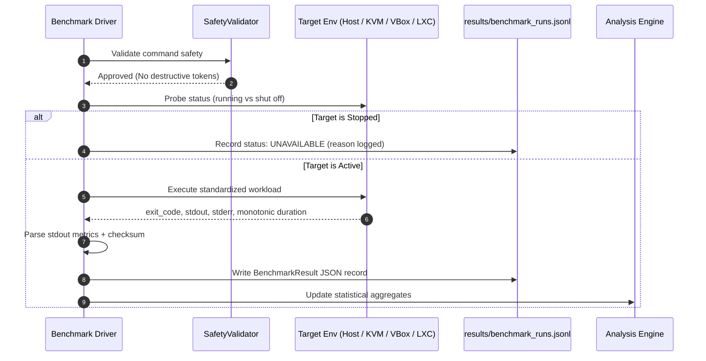

# CC2 Experimental Benchmarking Protocol & Plan

## 1. Core Experimental Principles

To ensure scientific validity and unbiased comparative evaluation between **Host Baseline**, **KVM/QEMU**, **VirtualBox**, and **Native LXC**, all benchmarking follows these rigorous tenets:

1. **Identical Workload Executable**:
   - The exact same compiled deterministic binaries (`cpu_workload` and `memory_workload`) are executed across all tested environments.
2. **Identical Input Parameters**:
   - Equal matrix size ($N = 400$) and equal iteration count ($I = 5$) for CPU evaluation.
   - Equal buffer allocation ($B = 128\text{ MB}$) and equal pass count ($P = 4$) for memory evaluation.
3. **Identical Resource Allocation**:
   - Guest VM / Container specifications are normalized to:
     - **vCPUs**: 2 vCPUs
     - **Memory**: 2048 MB RAM
   - Confirmed in discovery:
     - KVM (`ubuntu24.04`): `vcpus=2`, `maxMemory=2097152 KiB`
     - VirtualBox (`Ubuntu-Server-VBox`): `cpus=2`, `memory=2048`
     - LXC container (`lxc-ubuntu`): configured with equivalent cgroup constraints.
4. **Explicit Deviation Tracking**:
   - Any architectural disparity (e.g. host-passthrough CPU in KVM vs synthetic CPU in VirtualBox) must be explicitly noted in provenance logs.
5. **Traceability & Anti-Fabrication**:
   - Zero hardcoded or simulated values.
   - Every metric must be directly parseable from the command's raw `stdout`.
6. **Strict Status Handling**:
   - Allowed statuses: `success`, `failed`, `unavailable`.
   - **Never convert missing data to zero**. Missing or stopped environments are preserved as `unavailable` with explicit explanatory notes.

---

## 2. Experimental Execution Matrix

| Parameter | Host Baseline | KVM / QEMU | VirtualBox | Native LXC |
|:---|:---|:---|:---|:---|
| **Hypervisor Mode** | Bare-Metal | Type-1 / Type-1-like | Type-2 Hosted | OS-Level Container |
| **Target Identity** | Host CPU / OS | `ubuntu24.04` | `Ubuntu-Server-VBox` | `lxc-ubuntu` |
| **Allocated vCPUs** | 12 (host) / 2 (taskset) | 2 vCPUs | 2 vCPUs | 2 vCPUs (cgroups) |
| **Allocated RAM** | 16 GB (host) / 2 GB (limit) | 2048 MB | 2048 MB | 2048 MB |
| **CPU Benchmark** | `cpu_workload --size 400 --iterations 5` | Same | Same | Same |
| **Memory Benchmark** | `memory_workload --buffer-mb 128 --passes 4` | Same | Same | Same |
| **Repetitions** | 5 warmups + 10 measurement runs | Same | Same | Same |
| **Checksum Verification**| FNV-1a Hash Match | Same | Same | Same |

---

## 3. Workload Mathematical Models

### 3.1 CPU Deterministic Workload (`cpu_workload.c`)
- **Computational Core**: Double-precision matrix multiplication ($C_{ij} = \sum_{k} A_{ik} B_{kj}$) initialized with deterministic trigonometric values ($A[i] = \sin(i)$, $B[i] = \cos(i)$).
- **Floating-Point Operations (FLOPs)**:
  $$\text{Total FLOPs} = 2 \times N^3 \times I$$
  For $N = 400$ and $I = 5$:
  $$\text{Total FLOPs} = 2 \times 400^3 \times 5 = 640{,}000{,}000\text{ FLOPs} = 0.64\text{ GFLOP}$$
- **Metric Formulation**:
  $$\text{GFLOPS} = \frac{\text{Total FLOPs}}{\Delta t \times 10^9}$$
- **Checksum**: FNV-1a hash over matrix $C$ guarantees identical computational outcomes regardless of hypervisor scheduling artifacts.

### 3.2 Memory Deterministic Workload (`memory_workload.c`)
- **Memory Operations**: Sequential write and interleaved read/XOR operations across a 128 MB 64-bit word buffer.
- **Transferred Bytes**:
  $$\text{Bytes} = 2 \times B_{\text{bytes}} \times P$$
  For $B = 128\text{ MB}$ and $P = 4$:
  $$\text{Bytes} = 2 \times (128 \times 1024^2) \times 4 = 1{,}073{,}741{,}824\text{ bytes (1 GiB)}$$
- **Metric Formulation**:
  $$\text{Throughput (MB/s)} = \frac{\text{Total Transferred MB}}{\Delta t}$$

---

## 4. Execution Lifecycle & Data Flow



---

## 5. Result Schema Definition

Every result recorded in `results/benchmark_runs.jsonl` strictly conforms to the following schema:

```json
{
  "environment": "kvm",
  "benchmark": "cpu_deterministic",
  "run_id": "cpu_deterministic-kvm-8f2c3a1e",
  "timestamp": "2026-09-16T12:30:00.000000+00:00",
  "command": "/home/karthik-chakala/Downloads/CC2/workloads/cpu_workload --size 400 --iterations 5",
  "exit_code": 0,
  "stdout": "{\n  \"workload\": \"cpu_deterministic\",\n  \"matrix_size\": 400,\n  \"iterations\": 5,\n  \"total_flops\": 640000000,\n  \"elapsed_sec\": 0.245123,\n  \"gflops\": 2.6109,\n  \"checksum\": \"0x8a92f1b4\",\n  \"status\": \"success\"\n}\n",
  "stderr": "",
  "parsed_metrics": {
    "workload": "cpu_deterministic",
    "matrix_size": 400,
    "iterations": 5,
    "total_flops": 640000000,
    "elapsed_sec": 0.245123,
    "gflops": 2.6109,
    "checksum": "0x8a92f1b4",
    "status": "success"
  },
  "status": "success"
}
```

---

## 6. Execution Roadmap

1. **Phase 1: Platform Inception & Host Discovery (COMPLETED)**
   - Complete non-destructive host introspection.
   - Dynamic discovery of KVM (`ubuntu24.04`), VirtualBox (`Ubuntu-Server-VBox`), and LXC (`lxc-ubuntu`).
   - Compilation and test execution of C deterministic workloads.
   - Automated unit test verification (100% pass rate).
2. **Phase 2: Guest Network & Access Readiness (NEXT PHASE)**
   - Verify guest credentials, SSH key exchange, or guest-agent availability for isolated remote workload dispatch without modifying host disk tables.
3. **Phase 3: Formal Benchmark Campaign**
   - Execute baseline host runs and guest runs.
   - Collect 10 iterations per environment.
4. **Phase 4: Statistical Synthesis & Visual Dashboard**
   - Compute mean, median, IQR, standard deviation, and comparative overhead ratios.
   - Render results in the CC2 React + TypeScript interactive dashboard.
