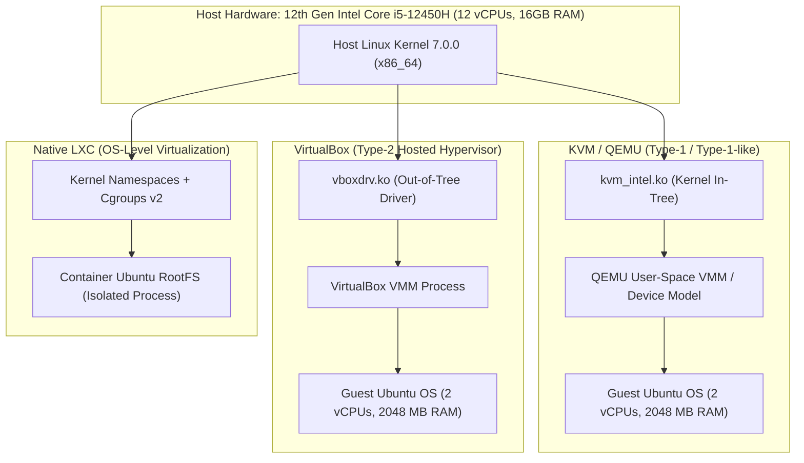

# Host Infrastructure & Virtualization Inventory
**Generated:** 2026-09-16T10:21:00.226087+00:00
**Collector:** CC2 Automated Discovery Engine (`inventory_collector.py`)
**Target System:** `karthik-chakala-Vivobook-ASUSLaptop-K3605ZU-K3605ZU` | `7.0.0-31-generic` (x86_64)

> [!IMPORTANT]
> **Experimental Principle**: All findings below reflect REAL measurements and hardware introspection directly discovered on the Ubuntu host. No fabricated values or hardcoded defaults are used.

## 1. System & Hardware Specifications

### 1.1 Host Operating System & Kernel
- **OS**: Ubuntu 24.04.5 LTS
- **Kernel Version**: `7.0.0-31-generic`
- **Kernel Details**: `#31~24.04.1-Ubuntu SMP PREEMPT_DYNAMIC Mon Aug 10 09:38:02 UTC 2`
- **Architecture**: `x86_64`
- **Host Virtualization Layer (`systemd-detect-virt`)**: `none (bare-metal)`
- **Uptime**: `15:51:00 up  1:22,  1 user,  load average: 5.12, 3.26, 2.39`

### 1.2 Central Processing Unit (CPU)
- **Processor Model**: 12th Gen Intel(R) Core(TM) i5-12450H
- **Architecture**: `x86_64`
- **Total Logical CPUs**: 12
- **Cores Per Socket**: 8
- **Threads Per Core**: 2
- **Sockets**: 1
- **Frequency Range**: 400.0000 MHz - 4400.0000 MHz
- **Hardware Virtualization Support**: VT-x (Intel VMX) Enabled

**Cache Hierarchy:**
- **L1d Cache**: 320 KiB (8 instances)
- **L1i Cache**: 384 KiB (8 instances)
- **L2 Cache**: 7 MiB (5 instances)
- **L3 Cache**: 12 MiB (1 instance)

### 1.3 Memory (RAM & Swap)
- **Total Physical Memory**: 15613 MB
- **Available Memory**: 8958 MB
- **Swap Space**: 4095 MB

```text
total        used        free      shared  buff/cache   available
Mem:            15Gi       6.5Gi       2.9Gi       781Mi       6.9Gi       8.7Gi
Swap:          4.0Gi          0B       4.0Gi
```

### 1.4 Network Interfaces & Virtual Bridges
| Interface | Type / State | IP Address | MAC Address | Role |
|:---|:---|:---|:---|:---|
| `lo` | UNKNOWN | `127.0.0.1/8` | `00:00:00:00:00:00` | Host Loopback |
| `wlo1` | UP | `172.16.51.105/23` | `a0:59:50:97:59:50` | Wireless Primary |
| `virbr0` | DOWN | `192.168.122.1/24` | `52:54:00:02:74:a2` | KVM/QEMU Bridge |
| `lxcbr0` | DOWN | `10.0.3.1/24` | `00:16:3e:00:00:00` | LXC Container Bridge |
| `enx00e04c680691` | UP | `172.16.112.117/23` | `00:e0:4c:68:06:91` | Ethernet Primary |

## 2. Virtualization Environments Discovered

### 2.1 KVM / QEMU (libvirt)
- **Classification**: Kernel-based hardware virtualization (Type-1 / Type-1-like).
- **KVM Module State**: `kvm_intel             540672  0
kvm                  1507328  1 kvm_intel
irqbypass              16384  1 kvm`
- **Hardware Acceleration (`/dev/kvm`)**: Accessible
- **libvirt Version**: `10.0.0`
- **Discovered Domains (VMs)**:
  | Name | State | vCPUs | Memory | Management Bus |
  |:---|:---|:---|:---|:---|
  | `ubuntu24.04` | shut off | 2 | 2097152 KiB | `qemu:///system` |

### 2.2 VirtualBox
- **Classification**: Hosted hypervisor (Type-2).
- **VirtualBox Installed**: Yes
- **VBoxManage Version**: `7.2.16r174877`
- **Kernel Driver (`vboxdrv`)**: Loaded in kernel space
- **Discovered Virtual Machines**:
  | VM Name | UUID | State | vCPUs | Memory (MB) |
  |:---|:---|:---|:---|:---|
  | `Ubuntu-Server-VBox` | `8a699556-1ddf-41cf-b252-c7c8b10255ac` | poweroff | 2 | 2048 |

### 2.3 Native Linux LXC Containers
- **Classification**: Linux OS-level virtualization / containerization.
- **LXC Installed**: Yes
- **LXC Version**: `5.0.3`
- **Bridge Network**: `lxcbr0` (10.0.3.1/24)
- **Host Cgroups**: Cgroups v2 enabled (`/sys/fs/cgroup`)
- **SubUID / SubGID Mapping**: `karthik-chakala:100000:65536`
- **Containers Detected in `/var/lib/lxc`**:
  - `lxc-ubuntu` (Path: `/var/lib/lxc/lxc-ubuntu`)

## 3. Toolchain & Benchmark Utility Matrix

| Utility | Installed | Executable Path | Version Summary |
|:---|:---:|:---|:---|
| `fio` | NO | - | Unavailable |
| `iperf3` | NO | - | Unavailable |
| `perf` | YES | `/usr/bin/perf` | perf version 7.0.14 |
| `strace` | YES | `/usr/bin/strace` | strace -- version 6.8 |
| `pidstat` | YES | `/usr/bin/pidstat` | Version flag not supported |
| `mpstat` | YES | `/usr/bin/mpstat` | Version flag not supported |
| `gcc` | YES | `/usr/bin/gcc` | gcc (Ubuntu 13.3.0-6ubuntu2~24.04.1) 13.3.0 |
| `g++` | YES | `/usr/bin/g++` | g++ (Ubuntu 13.3.0-6ubuntu2~24.04.1) 13.3.0 |
| `make` | YES | `/usr/bin/make` | GNU Make 4.3 |
| `clang` | NO | - | Unavailable |
| `python3` | YES | `/usr/bin/python3` | Python 3.12.3 |
| `node` | YES | `/home/karthik-chakala/.local/bin/node` | v20.18.0 |
| `npm` | YES | `/home/karthik-chakala/.local/bin/npm` | 10.8.2 |
| `virsh` | YES | `/usr/bin/virsh` | 10.0.0 |
| `VBoxManage` | YES | `/usr/bin/VBoxManage` | 7.2.16r174877 |
| `lxc-ls` | YES | `/usr/bin/lxc-ls` | 5.0.3 |
| `lxc-info` | YES | `/usr/bin/lxc-info` | 5.0.3 |
| `lxc-start` | YES | `/usr/bin/lxc-start` | 5.0.3 |
| `lxc-stop` | YES | `/usr/bin/lxc-stop` | 5.0.3 |
| `bc` | YES | `/usr/bin/bc` | bc 1.07.1 |
| `jq` | YES | `/usr/bin/jq` | jq-1.7 |
| `curl` | YES | `/usr/bin/curl` | curl 8.5.0 (x86_64-pc-linux-gnu) libcurl/8.5.0 OpenSSL/3.0.13 zlib/1.3 brotli/1.1.0 zstd/1.5.5 libidn2/2.3.7 libpsl/0.21.2 (+libidn2/2.3.7) libssh/0.10.6/openssl/zlib nghttp2/1.59.0 librtmp/2.3 OpenLDAP/2.6.10 |
| `wget` | YES | `/usr/bin/wget` | GNU Wget 1.21.4 built on linux-gnu. |
| `lshw` | YES | `/usr/bin/lshw` | Version flag not supported |
| `dmidecode` | YES | `/usr/sbin/dmidecode` | 3.5 |

## 4. Hypervisor Architectural Comparison



### Key Theoretical Divergence
1. **KVM (Kernel-based Virtual Machine)**:
   - Turns the Linux kernel itself into a hypervisor via the `/dev/kvm` interface.
   - Hardware-assisted virtualization (Intel VT-x) allows guest code to execute directly on the CPU (VMX non-root mode).
   - Classified as Type-1 / Type-1-like because the hypervisor is integrated directly into the kernel controlling hardware resources.
2. **QEMU (Quick Emulator)**:
   - Serves as the user-space virtual machine monitor (VMM) and hardware device emulation layer (virtio, PCI controllers, ACPI).
   - Interacts with `/dev/kvm` for CPU scheduling and memory mapping.
3. **VirtualBox**:
   - Classic Type-2 hosted hypervisor operating on top of a standard host OS through specialized loadable kernel modules (`vboxdrv`).
   - Context switches between host OS, kernel driver, and guest context introduce additional abstraction layers compared to in-tree KVM.
4. **LXC (LinuX Containers)**:
   - Pure OS-level virtualization. No hypervisor, no virtual machine monitor, and no guest kernel.
   - Provides process and resource isolation using native Linux kernel primitives: namespaces (PID, mount, UTS, IPC, network, user) and cgroups v2 (CPU, memory, blkio).
   - Near-native execution performance with virtually zero hypervisor overhead.

---
*Host Inventory generated automatically by CC2 Benchmarking Suite.*