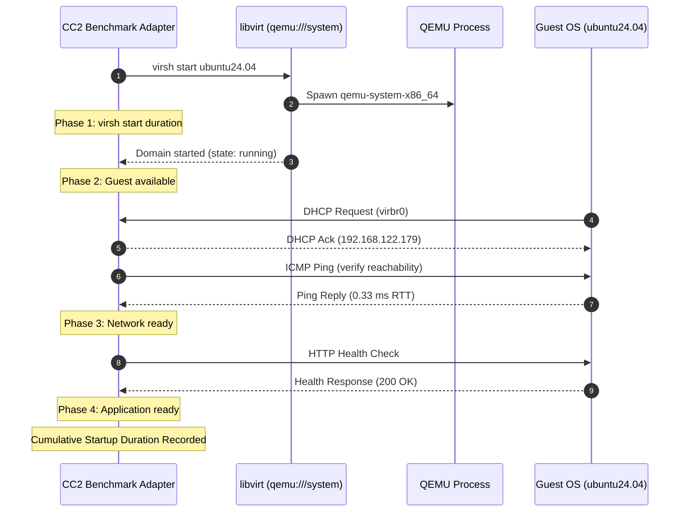

# CC2 KVM/QEMU Benchmark & Lifecycle Adapter Specification

## Executive Summary

The **CC2 KVM/QEMU Benchmark Adapter** (`benchmark/runner/environments/kvm.py`) provides an autonomous, non-destructive orchestration and telemetry layer for evaluating **kernel-based hardware virtualization / commonly classified as Type-1 or Type-1-like** on Ubuntu Linux. By leveraging the in-tree `kvm.ko` kernel module and Intel VT-x hardware assist, KVM turns the Linux host kernel into a bare-metal hypervisor, executing guest code directly on physical CPUs while QEMU provides userspace device emulation. (Note: KVM is not a standalone GRUB-launched hypervisor like Xen). It interacts directly with the system libvirt daemon (`qemu:///system`) and host kernel telemetry to quantify CPU, memory, storage, network, and application-level performance without manual intervention or hardcoded identifiers.

---

## 1. Dynamic KVM Discovery

All virtualization properties are queried dynamically via libvirt API and domain XML inspection.

### 1.1 Discovered Domain Specifications (`ubuntu24.04`)
- **Domain Name**: `ubuntu24.04` (Dynamically selected as preferred Ubuntu instance)
- **Hypervisor**: QEMU/KVM (`/usr/bin/qemu-system-x86_64`)
- **Acceleration**: Hardware-assisted virtualization via `/dev/kvm` (Intel VT-x)
- **Machine Type**: `pc-q35-noble` (Q35 chipset with PCIe root topology)
- **Firmware**: Standard SeaBIOS (`hvm` boot dev `hd`)
- **vCPUs**: 2 vCPUs (`host-passthrough` CPU mode)
- **Configured Memory**: 2048 MB (`2097152 KiB`)
- **Primary Disk**:
  - Image Path: `/var/lib/libvirt/images/ubuntu24.04.qcow2`
  - Disk Driver: `qemu` / `qcow2` (Discard: `unmap`)
  - Target Bus: `virtio` (`vda`)
  - Virtual Capacity: 20 GiB (`21,474,836,480` bytes)
  - Physical Allocation: 4.88 GiB (`5,137,063,936` bytes)
- **Network Interface**:
  - Device Model: `virtio-net-pci`
  - MAC Address: `52:54:00:0c:f3:68`
  - Source Bridge: `default` (`virbr0`, subnet `192.168.122.0/24`)
  - Dynamically Assigned IP: `192.168.122.179` (Hostname: `kvm-ubuntu`)

---

## 2. KVM Lifecycle Management & Startup Profiling

The adapter enforces graceful lifecycle control, completely avoiding destructive `virsh destroy` commands in favor of ACPI signaling (`virsh shutdown`).

### 2.1 Four-Phase Startup Timing
1. **`virsh start` Initiation**: Execution duration of the management API call.
2. **Guest Available**: State transition from `shut off` to `running` (vCPUs active).
3. **Network Ready**: DHCP lease acquisition and verification via ICMP ping reachability.
4. **Application Ready**: Response from HTTP health service / application port.

---

## 3. Workload Evaluation & Resource Telemetry

### 3.1 CPU Workload
- Executes the statically linked `workloads/dist/cpu_workload` binary.
- **Host QEMU Telemetry**:
  - Interrogates the host QEMU process PID via `/proc/<pid>/stat` and `/proc/<pid>/status`.
  - Measures host-side CPU tick consumption, user/system time, and active threads.
- **Libvirt Hypervisor Telemetry**:
  - `cpu.time`: Cumulative nanoseconds spent on physical CPUs.
  - `vcpu.0.time`, `vcpu.1.time`: Per-core execution metrics.
  - `exits.sum`: Hardware VM-exit transitions (trapped to hypervisor).
  - Context switches, page faults, and hardware counters via `/usr/bin/time -v` and `perf`.

### 3.2 Memory Breakdown: Allocated vs Actual Consumption
The adapter enforces a clear distinction between assigned boundaries and real resource usage:

| Dimension | Metric | Source | Meaning |
|:---|:---|:---|:---|
| **Allocated RAM** | 2048 MB | Domain XML / `balloon.maximum` | Maximum static ceiling assigned to VM |
| **Guest Active RAM** | ~217 MB | `balloon.current - balloon.available` | Real RAM utilized by guest OS |
| **Guest Available RAM** | ~1831 MB | `balloon.available` / `balloon.unused` | Free/buff/cache memory available to guest processes |
| **Host QEMU RSS** | ~610 MB | `VmRSS` from `/proc/<pid>/status` | Physical RAM pages mapped on the Ubuntu host |
| **Host QEMU VSZ** | ~3.42 GB | `VmSize` from `/proc/<pid>/status` | Virtual memory footprint of QEMU address space |

### 3.3 Storage Benchmarking (`fio`)
- **Non-Destructive Safety Boundary**:
  - Operates **strictly on a temporary regular file** (e.g. `results/test_fio.dat`).
  - Blocks any target pointing to `/dev/*`, block devices, or raw QEMU disk images.
- **Evaluated Modes**:
  - Sequential Read (`seqread`)
  - Sequential Write (`seqwrite`)
  - Random 4KB Read (`randread`)
  - Random 4KB Write (`randwrite`)
- **Metrics Collected**: Throughput (KB/s), IOPS, average latency, $p_{95}$ latency, and $p_{99}$ latency.
- **Graceful Degradation**: If `fio` is missing, records `status: unavailable` with explicit reason (`fio binary not found`).

### 3.4 Network Telemetry
- **Dynamic IP Resolution**: Resolves IP address dynamically through `virsh domifaddr` and `virsh net-dhcp-leases`.
- **ICMP Ping**:
  - Measures `min`, `avg`, `max`, `mdev` round-trip latency, and `packet_loss_percent`.
  - Baseline on `virbr0`: $\text{RTT}_{\text{avg}} \approx 0.33\text{ ms}$, $0\%$ packet loss.
- **Throughput (`iperf3`)**:
  - Evaluates bandwidth, bytes transferred, and retransmits over 30-second window.
  - If `iperf3` is absent: marked `status: unavailable` (no fabricated values).

### 3.5 Application Latency Protocol
- Measures 100 consecutive HTTP health requests.
- Collects:
  - Connection setup time
  - Time to First Byte (TTFB)
  - Total round-trip duration
- Computes: `mean`, `median`, $p_{50}$, $p_{95}$, $p_{99}$.

### 3.6 Isolation Verification
- Captures system virtualization layer signatures:
  - Host: `systemd-detect-virt: none (bare-metal)`
  - PID 1 namespaces (`/proc/1/ns/*`: cgroup, ipc, mnt, net, pid, time, user, uts)
  - Cgroup v2 hierarchies (`/proc/self/cgroup`)
  - Mount topology (`findmnt`) and network interfaces (`ip addr`)

---

## 4. Implementation Artifacts

- **Adapter Module**: [`benchmark/kvm_adapter.py`](file:///home/karthik-chakala/Downloads/CC2/benchmark/kvm_adapter.py)
- **Unit Test Suite**: [`tests/test_kvm_adapter.py`](file:///home/karthik-chakala/Downloads/CC2/tests/test_kvm_adapter.py)
- **Common Workload Package**: [`workloads/dist/`](file:///home/karthik-chakala/Downloads/CC2/workloads/dist/)
- **Documentation**: [`docs/KVM.md`](file:///home/karthik-chakala/Downloads/CC2/docs/KVM.md)
