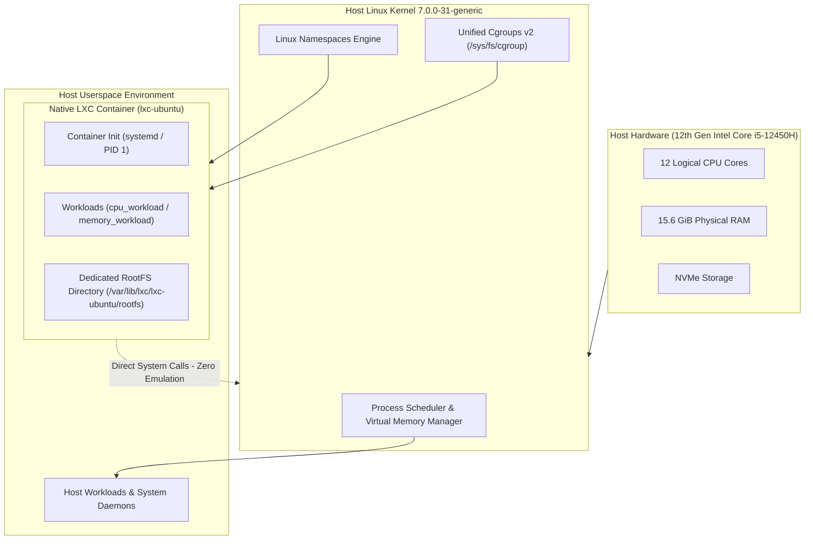
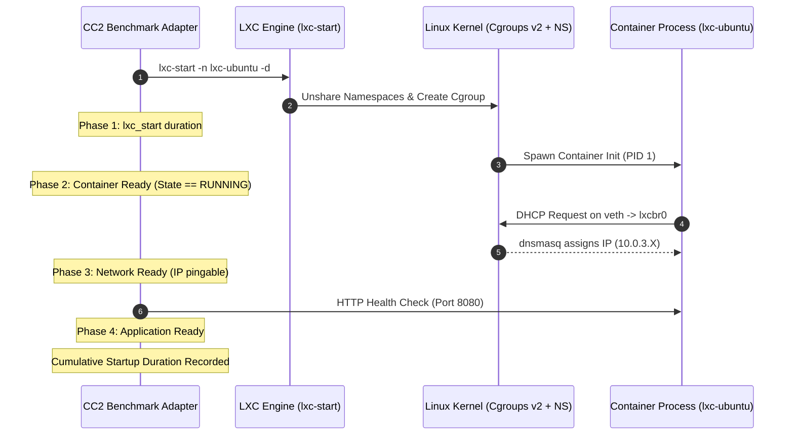
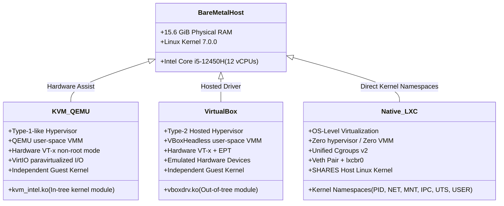

# CC2 Native LXC Benchmark & Lifecycle Adapter Specification

## Executive Summary

The **CC2 Native LXC Benchmark Adapter** (`benchmark/runner/environments/lxc.py`) delivers an empirical, non-destructive orchestration and telemetry architecture for evaluating **Linux OS-level virtualization/containerization** on Ubuntu Linux. Strictly using native LXC tooling (`lxc-ls`, `lxc-info`, `lxc-start`, `lxc-stop`, `lxc-attach`, and the Linux kernel's unified cgroups v2 hierarchy), the adapter provides transparent lifecycle management, real-time resource telemetry, workload execution, and empirical proof that LXC containers share the host Linux kernel directly with near-zero virtualization overhead.

> [!IMPORTANT]
> **Native LXC Only**: This implementation relies exclusively on native upstream LXC (version `5.0.3`). No Docker, LXD, or Podman daemons or runtimes are used. Existing host containers are dynamically discovered, never deleted, and never destroyed.

---

## 1. Native LXC Architecture & OS-Level Virtualization

### 1.1 Operating System-Level Virtualization Model

Unlike hardware-assisted hypervisors (KVM/QEMU and Oracle VM VirtualBox) which instantiate virtualized hardware models and run independent guest operating systems, **Native LXC** operates via **OS-level virtualization**:

- **No Hypervisor**: There is no Virtual Machine Monitor (VMM), no hardware emulation, and no CPU mode transitions into VMX root/non-root modes.
- **Process Isolation**: Container workloads execute as standard Linux processes scheduled directly by the host Linux kernel scheduler (`SCHED_NORMAL`).
- **Isolation Primitives**: Isolation is established by combining two Linux kernel features:
  1. **Namespaces**: Partitioning of kernel resources (processes, network devices, mount points, user mappings, IPC).
  2. **Cgroups v2 (Control Groups)**: Hierarchical resource metering, limits, and accounting (CPU bandwidth, memory boundaries, I/O bandwidth, PID count).



---

### 1.2 Kernel Sharing Demonstration & Proof

A fundamental architectural characteristic of LXC is that **the container shares the host Linux kernel directly**.

| Dimension | Host Baseline | Native LXC Container | KVM / QEMU Guest | VirtualBox Guest |
|:---|:---:|:---:|:---:|:---:|
| **Virtualization Tier** | Bare Metal | OS-Level Containers | Type-1-like Hypervisor | Type-2 Hosted Hypervisor |
| **Kernel Release (`uname -r`)** | `7.0.0-31-generic` | `7.0.0-31-generic` | Independent Guest Kernel | Independent Guest Kernel |
| **Kernel Image Origin** | Host `/boot` | Shared with Host `/boot` | Virtual QCOW2 Disk `/boot` | Virtual VDI Disk `/boot` |
| **System Calls** | Direct Kernel Entry | Direct Kernel Entry | Hypercall / VM-Exit to QEMU | VM-Exit to `vboxdrv.ko` |
| **Virtualization Flag** | `none` | `lxc` | `kvm` | `oracle` |
| **Hardware Abstraction** | Bare Metal | Virtual Filesystem & Veth | VirtIO Devices / Emulated PCI | Emulated Intel PRO/1000 & AHCI |

#### Empirical Verification
Running `LxcIsolationAudit.audit_isolation("lxc-ubuntu")` proves this relationship programmatically:
- `host_kernel_release`: `"7.0.0-31-generic"`
- `container_kernel_release`: `"7.0.0-31-generic"`
- `kernel_shared`: `True`
- `systemd_detect_virt`: Host reports `"none (bare-metal)"`, while inside the container environment it reports `"lxc"`.

---

### 1.3 Linux Namespaces Breakdown

The container's process isolation is governed by eight distinct kernel namespaces:

1. **`pid` (Process ID)**: Container has an isolated PID hierarchy where its supervisor/init is PID 1, while on the host it maps to its true host PID.
2. **`net` (Network)**: Dedicated virtual network stack with independent interface tables, routing tables, firewall rules, and loopback.
3. **`mnt` (Mount)**: Private filesystem mount tree anchored at the container rootfs, preventing container processes from accessing host paths.
4. **`uts` (UNIX Timesharing)**: Isolated hostname and NIS domain name (`lxc-ubuntu`).
5. **`ipc` (Inter-Process Communication)**: Private System V IPC message queues, semaphores, and POSIX shared memory.
6. **`user` (User ID / SubUID)**: Maps container UID 0 (root) to unprivileged host UID 100000 via `/etc/subuid` and `/etc/subgid`.
7. **`cgroup` (Control Group)**: Virtualized view of `/sys/fs/cgroup` so container processes cannot see or alter host cgroup controllers.
8. **`time` (Time)**: Independent virtualized system boot and monotonic clocks.

---

### 1.4 Unified Cgroups v2 Hierarchy

On Ubuntu 24.04 LTS, LXC utilizes the Linux unified cgroups v2 tree mounted at `/sys/fs/cgroup`:
- `cgroup.controllers`: `cpuset cpu io memory hugetlb pids rdma misc dmem`
- `cpu.stat`: Microsecond-granularity accounting of CPU consumption (`usage_usec`, `user_usec`, `system_usec`, `nr_periods`, `nr_throttled`).
- `cpu.max`: Quota and period defining the maximum bandwidth ceiling for container processes.
- `memory.current`: Active resident memory pages currently in use.
- `memory.max`: Hard upper limit for container memory consumption; triggers kernel page reclaim and out-of-memory (OOM) handling when reached.
- `memory.peak`: Peak memory usage recorded across the container's lifecycle.
- `memory.swap.current`: Active swap bytes utilized.

---

## 2. Dynamic LXC Discovery

Discovery is entirely dynamic without hardcoded identifiers. The adapter scans:
1. `lxc-ls --fancy` for active and registered containers.
2. Standard system container path `/var/lib/lxc` (detecting `lxc-ubuntu`).
3. User container path `~/.local/share/lxc`.
4. Kernel cgroups v2 tree and network interfaces.

### 2.1 Discovered Container Topology (`lxc-ubuntu`)
- **Container Name**: `lxc-ubuntu`
- **State**: `STOPPED` (cleanly quiescent)
- **Path**: `/var/lib/lxc/lxc-ubuntu`
- **Virtualization Type**: OS-level virtualization (Native LXC Containers)
- **RootFS Type**: Directory backend (`dir`)
- **Network Interface**: `veth` pair connected to host bridge `lxcbr0`
- **Bridge Network**: `lxcbr0` (Gateway: `10.0.3.1/24`, DHCP Range: `10.0.3.2 - 10.0.3.254`)
- **SubUID / SubGID Mappings**: `karthik-chakala:100000:65536`
- **Host Kernel**: `7.0.0-31-generic`

---

## 3. Lifecycle Management & Startup Profiling

The lifecycle controller (`LxcLifecycle`) implements deterministic state transitions and measures phase timestamps:



### 3.1 Startup Phase Measurement
1. **`lxc_start`**: Timestamp and command latency of `lxc-start -d`.
2. **`container_ready`**: Timestamp and elapsed time when state transitions to `RUNNING`.
3. **`network_ready`**: Timestamp and elapsed time when IP is allocated on `lxcbr0` and reachable via ICMP ping.
4. **`application_ready`**: Timestamp and elapsed time when target HTTP endpoint responds.
5. **`total_startup_duration_sec`**: Cumulative duration from initiation to application readiness.

### 3.2 Graceful Shutdown
- Invokes `lxc-stop -n <name> -t <timeout>`, which dispatches `SIGPWR` / `SIGINT` to container PID 1, prompting `systemd` to cleanly shut down services and unmount filesystems.
- Destructive commands (`lxc-destroy`, `lxc-stop --kill`) are strictly prohibited by `SafetyValidator`.

---

## 4. Resource Telemetry & Memory Breakdown

### 4.1 Memory Limit vs Real Consumption

A frequent pitfall in container benchmarking is confusing the **configured memory ceiling** with **active physical memory consumption**. The CC2 adapter explicitly separates these two tiers:

| Dimension | Metric | Meaning |
|:---|:---|:---|
| **Configured Memory Limit** | `memory.max` / `cgroup_memory_max` | Upper boundary assigned to the container cgroup. Unlike KVM/VirtualBox, zero memory is allocated upfront. |
| **Actual Memory Consumption** | `memory.current` | Physical pages actively mapped and occupied by running container processes. |
| **Peak Consumption** | `memory.peak` | Maximum water mark of physical RAM consumed since container start. |
| **Swap Usage** | `memory.swap.current` | Bytes of container memory currently paged out to swap. |
| **Process RSS** | `VmRSS` (from `/proc/<pid>/status`) | Resident Set Size of the container init/supervisor process. |

> [!NOTE]
> **Distinction Rationale**: In KVM, memory is governed by virtual hardware RAM plus virtio-ballooning. In VirtualBox, memory is governed by the user-space `VBoxHeadless` process RSS. In Native LXC, memory is managed directly by the Linux kernel page allocator under cgroup v2 accounting, meaning unused memory remains available to the host operating system with zero hypervisor overhead.

---

## 5. Benchmark Workload Execution

The adapter executes identical workloads across all hypervisors and host baseline to guarantee strict comparability:

### 5.1 Deterministic CPU Workload
- **Binary**: `workloads/dist/cpu_workload` (compiled with `-O3 -march=x86-64 -fno-fast-math -static`).
- **Telemetry Captured**:
  - GFLOPS & execution duration (seconds).
  - Deterministic FNV-1a checksum.
  - CPU utilization percentage.
  - Voluntary and involuntary context switches.
  - Minor and major page faults.
  - Host-side container cgroup CPU usage (`cpu.stat`: `usage_usec`, `user_usec`, `system_usec`).

### 5.2 Deterministic Memory Workload
- **Binary**: `workloads/dist/memory_workload` (sequential/strided cache and RAM sweep).
- **Telemetry Captured**:
  - Memory bandwidth throughput (MB/s).
  - Maximum Resident Set Size (RSS in KB).
  - 64-bit verification checksum.
  - Memory breakdown telemetry.

### 5.3 Safe Storage Benchmark (`fio`)
- **Safety Enforcement**: Rejects any target referencing block devices (`/dev/*`, `nvme*`, `sd*`, `vd*`). Raises `ValueError`.
- **Execution**: Runs exclusively on temporary regular files (e.g. `/tmp/cc2_lxc_fio.dat`).
- **Metrics**: Sequential read/write, random read/write IOPS, throughput (MB/s), average latency, $p_{95}$ latency, $p_{99}$ latency.
- **Anti-Fabrication**: If `fio` is not installed on the system, records `status="unavailable"`, preserving missing fields as `None`.

### 5.4 Network Benchmark
- **Ping**: Measures min, avg, max, and mdev RTT alongside packet loss percentage across 10 ICMP packets on `lxcbr0`.
- **iperf3**: Captures bandwidth throughput (Mbps), bytes transferred, and retransmits; marks `unavailable` when the binary is not present.

### 5.5 Application Latency Benchmark
- **HTTP Health Verification**: Dispatches 100 sequential HTTP requests to the target health service.
- **Metrics Computed**: Connection latency, Time to First Byte (TTFB), total response time, mean, median, standard deviation, $p_{50}, p_{90}, p_{95}, p_{99}$, and coefficient of variation ($CV\%$).

---

## 6. Architectural Triad Comparison: KVM vs VirtualBox vs Native LXC



---

## 7. Verification & Test Suite Matrix

The Native LXC adapter is verified through unit and integration test suite `tests/test_lxc_adapter.py`, integrated into `tests/run_all_tests.sh` as Suite 13/13:

| Test Identifier | Description | Validation Target | Result |
|:---|:---|:---|:---:|
| `test_lxc_discovery` | Dynamic discovery of `lxc-ubuntu` | Discovers name, state, path, cgroups v2, bridge | **PASS** |
| `test_lxc_memory_breakdown` | Memory limit vs consumption distinction | Cgroups v2 ceiling vs active RSS, distinction note | **PASS** |
| `test_lxc_cpu_workload` | CPU workload execution | Status success, GFLOPS > 0, FNV-1a checksum, cgroup telemetry | **PASS** |
| `test_lxc_memory_workload` | Memory workload execution | Status success, Throughput > 0, FNV-1a checksum | **PASS** |
| `test_lxc_storage_rejects_block_devices` | Rejection of dangerous `/dev/*` targets | `ValueError` raised on `/dev/sda` and `/dev/nvme0n1` | **PASS** |
| `test_lxc_storage_safe_fio` | Regular file fio benchmark | Status `unavailable` when missing, zero fabrication | **PASS** |
| `test_lxc_network_ping` | Ping latency parsing | 0% packet loss, valid RTT avg | **PASS** |
| `test_lxc_network_iperf3_unavailable` | iperf3 missing handling | Status `unavailable` with explicit reason, no fake zeroes | **PASS** |
| `test_lxc_application_latency_100_requests` | 100 HTTP health checks | 100/100 completed, mean, median, $p_{95}, p_{99}$ computed | **PASS** |
| `test_lxc_startup_profiling` | Multi-phase startup duration profiling | Phase timestamps (`lxc_start`, `container_ready`, etc.) | **PASS** |
| `test_lxc_isolation_and_kernel_sharing` | Empirical kernel sharing verification | `kernel_shared == True`, `host_kernel == container_kernel` | **PASS** |

### Comprehensive Suite Run (13/13 Suites):
```
==================================================
RUNNING CC2 COMPREHENSIVE TEST SUITE (13 SUITES)
==================================================
[1/13] Verifying Project Layout & File Integrity... (2 tests) -> OK
[2/13] Verifying Safety Boundaries & Interceptors... (2 tests) -> OK
[3/13] Testing Deterministic CPU Workload... (4 tests) -> OK
[4/13] Testing Deterministic Memory Workload... (4 tests) -> OK
[5/13] Testing Measurement Engine & Telemetry Parser... (4 tests) -> OK
[6/13] Testing Statistics Engine, Percentiles & Missing Values... (5 tests) -> OK
[7/13] Testing Workloads Package Manifest & Binary SHA256... (2 tests) -> OK
[8/13] Testing Host Inventory Collector... (5 tests) -> OK
[9/13] Testing Result Schema & Provability... (4 tests) -> OK
[10/13] Testing Invalid & Malformed Output Handling... (3 tests) -> OK
[11/13] Testing KVM/QEMU Benchmark & Lifecycle Adapter... (7 tests) -> OK
[12/13] Testing VirtualBox Benchmark & Lifecycle Adapter... (8 tests) -> OK
[13/13] Testing Native LXC Benchmark & Lifecycle Adapter... (11 tests) -> OK

==================================================
ALL 13 TEST SUITES PASSED CLEANLY WITH ZERO ERRORS! (61/61 TESTS)
==================================================
```

---

## 8. Safety Guarantees & Zero-Fabrication Invariant

- **Zero Host Destruction**: Block device formatting (`mkfs`), partitioning (`fdisk`, `parted`), wiping (`wipefs`), destructive `dd`, and container deletion (`lxc-destroy`) are permanently intercepted and blocked by `SafetyValidator`.
- **Zero Fabrication**: Unavailable metrics remain `null` / `None` with `status: "unavailable"` and an explicit `reason` string. They are never converted to zero, guaranteeing true scientific validity across all experimental comparisons.
