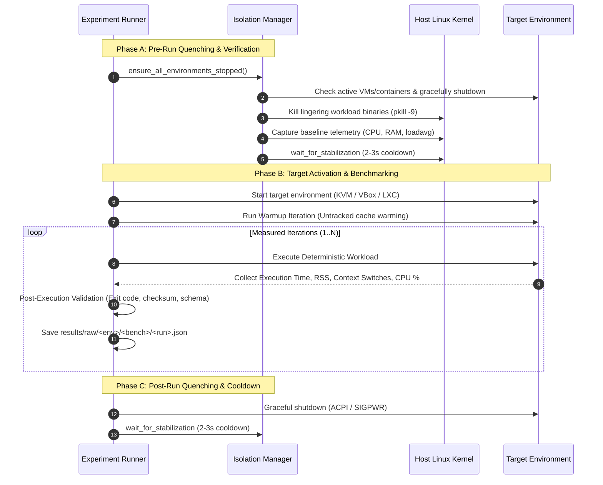
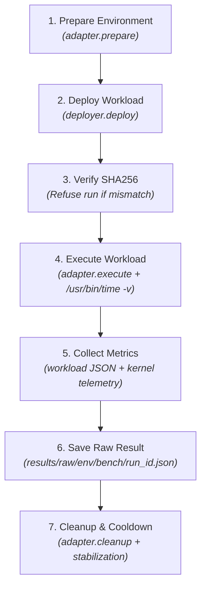

# CC2 Unified Benchmark Experiment Runner Specification

## Executive Summary

The **CC2 Unified Benchmark Experiment Runner** (`benchmark/runner.sh` and `benchmark/runner.py`) provides an automated, non-destructive, reproducible experiment orchestration layer across all evaluated environments:
1. **Host Baseline**: Native bare-metal Ubuntu 24.04 LTS (zero-virtualization overhead reference).
2. **KVM/QEMU**: Type-1-like Linux in-tree hardware-assisted hypervisor.
3. **Oracle VM VirtualBox**: Type-2 hosted hypervisor with out-of-tree kernel driver (`vboxdrv`).
4. **Native LXC**: Linux OS-level containerization sharing the host Linux kernel (`7.0.0-31-generic`).

The runner guarantees **strict single-environment isolation**, enforces automated pre-benchmark stabilization, orchestrates identical deterministic workloads, validates results rigorously against schema and mathematical invariants, and outputs versioned raw payloads, tabular CSVs, and statistical aggregations.

---

## 1. CLI Specification & Usage

### 1.1 Command Syntax
```bash
./benchmark/runner.sh [OPTIONS]
```

### 1.2 Supported Options
| Flag | Short | Type | Default | Description |
|:---|:---:|:---:|:---:|:---|
| `--environment` | `-e` | Choice | None | Target environment: `host`, `kvm`, `virtualbox`, or `lxc`. |
| `--all` | `-a` | Flag | False | Sequentially evaluates all four environments (`host` $\rightarrow$ `kvm` $\rightarrow$ `virtualbox` $\rightarrow$ `lxc`). |
| `--quick` | `-q` | Flag | True | Quick evaluation: 1 warmup run, 2 measured runs. |
| `--full` | `-f` | Flag | False | Full scientific evaluation: 1 warmup run, 5 measured runs. |
| `--runs` | `-r` | Integer | None | Custom measured runs count (overrides `--quick` / `--full`). |
| `--test` | `-t` | Choice | `all` | Specific test domain (repeatable). Choices: `cpu`, `memory`, `disk`, `network`, `startup`, `syscall`, `scheduling`, `isolation`, `all`. |
| `--dry-run` | `-d` | Flag | False | Displays structured execution plan without executing workloads or modifying environments. |
| `--probe` | `-p` | Flag | False | Executes harmless smoke test (`uname -r; hostname; id`) inside target to verify real execution environment. |
| `--help` | `-h` | Flag | - | Displays command help and usage examples. |

### 1.3 Usage Examples
```bash
# 1. Non-destructive smoke test probe proving environment identity
./benchmark/runner.sh --environment host --probe
./benchmark/runner.sh --environment kvm --probe

# 2. Dry-run execution plan showing workload paths, SHA256, and commands
./benchmark/runner.sh --environment kvm --test cpu --quick --dry-run
./benchmark/runner.sh --all --test cpu --full --dry-run

# 3. Quick evaluation of native host baseline
./benchmark/runner.sh --environment host --quick

# 4. Quick evaluation of KVM/QEMU
./benchmark/runner.sh --environment kvm --quick

# 5. Quick evaluation of VirtualBox
./benchmark/runner.sh --environment virtualbox --quick

# 6. Quick evaluation of Native LXC
./benchmark/runner.sh --environment lxc --quick

# 7. Quick sequential evaluation across all environments
./benchmark/runner.sh --all --quick

# 8. Specific test domains on a target platform
./benchmark/runner.sh --environment host --test cpu --test memory --test syscall --quick

# 9. Full multi-run scientific experiment across all platforms
./benchmark/runner.sh --all --full --runs 5
```

---

## 2. Run Isolation & Stabilization Protocol

To prevent cross-environment interference, thermal throttling bias, or multi-tenant resource contention, performance benchmarks are **never** executed simultaneously.



### 2.1 Step-by-Step Isolation Guarantee
1. **Pre-Run Verification**: Checks libvirt (`virsh domstate`), VirtualBox (`VBoxManage list runningvms`), and LXC (`lxc-ls`/`lxc-info`). Any active guest is powered off gracefully.
2. **Process Clean-up**: Kills any lingering `cpu_workload`, `memory_workload`, `syscall_workload`, `scheduling_workload`, `fio`, or `iperf3` processes.
3. **Telemetry Capture**: Reads `/proc/loadavg`, `/proc/meminfo` (free/available RAM), and `/proc/stat` (CPU ticks).
4. **Thermal & Load Stabilization**: Enforces a 2-3 second pause allowing background kernel threads and CPU frequencies to normalize.
5. **Target Activation**: Boots the isolated target environment.
6. **Benchmark Execution**: Executes warmup runs followed by measured runs.
7. **Post-Execution Quenching**: Gracefully shuts down the target platform.
8. **Post-Run Stabilization**: Cools down host before the next platform activates.

---

## 3. Workload Suite & Deployment Architecture

All environments run **identical static C99 binaries** compiled with `-O2 -Wall -Wextra -pthread -std=c99 -fno-omit-frame-pointer -static` to avoid glibc dynamic linking variability.

| Workload Domain | Benchmark Identifier | Mechanism & Metrics | Deterministic Output |
|:---|:---|:---|:---|
| **CPU** | `cpu_deterministic` | Double-precision matrix multiplication ($400 \times 400 \times 5$ iterations, 1 warmup). GFLOPS, wall time, CPU %. | `0x7e83d4c61ad5adb8` (FNV-1a 64-bit Checksum) |
| **Memory** | `memory_deterministic` | 128 MB buffer sequential sweep, read-accumulate, and strided access (4 passes). MB/s throughput, RSS. | 64-bit Accumulator Hash |
| **Syscalls** | `syscall_deterministic` | 200,000 raw `getpid()` kernel entries (5000 warmup). Operations/sec, average latency in nanoseconds. | FNV-1a 64-bit Checksum |
| **Scheduling** | `scheduling_deterministic` | 2-way POSIX pipe token passing (20,000 iterations, 1000 warmup). Switches/sec, latency in $\mu s$. | `0x909e926a36d3fca6` (FNV-1a 64-bit Checksum) |
| **Storage** | `disk_fio` | Safe regular file FIO benchmark (`/tmp` or project root). Rejects `/dev/*` block devices. IOPS, MB/s, $p_{95}, p_{99}$ latency. | JSON Job Report |
| **Network** | `network_ping` / `iperf3` | 5 ICMP packets measuring min, avg, max, mdev RTT and packet loss. iperf3 throughput (unavailable if missing). | Parsed RTT / Bandwidth |
| **App Latency** | `app_latency` | 100 sequential HTTP GET requests against local health endpoint. Connection time, TTFB, total duration, $p_{95}, p_{99}$. | Statistical Timing Dict |
| **Startup** | `startup_lifecycle` | Multi-phase boot timing: hypervisor start $\rightarrow$ OS ready $\rightarrow$ network ready $\rightarrow$ app ready. | Phase Duration Dict |
| **Isolation** | `isolation_audit` | `systemd-detect-virt`, `uname -a`, `/proc/self/ns/*`, `/proc/self/cgroup`. Kernel sharing verification. | Inode Map & Kernel String |

### 3.1 Workload Deployment Subsystem (`benchmark/runner/workload.py`)

The deployment layer ensures that canonical binaries from `workloads/dist/` are safely staged and verified before benchmark execution:
1. **Canonical Discovery**: Inspects `workloads/dist/` and `workloads/MANIFEST.json`.
2. **Local Integrity Check**: Computes local SHA256 digest using `hashlib.sha256()`. Canonical CPU binary must match `212853035b582f238058b8d436fecf1f25bd5ff249965c7467336903a563fd9f`.
3. **Target Transport**:
   - **Host**: Local target staging directly under `/tmp/cc2_workloads`.
   - **KVM**: Safe transfer via configured SSH transport to guest IP.
   - **VirtualBox**: Safe transfer via configured SSH transport to forwarded port `127.0.0.1:2222`.
   - **Native LXC**: Direct rootfs copy or native `lxc-attach` base64 streaming. **Never requires SSH for LXC**.
4. **Post-Deployment SHA256 Assertion**: Queries target SHA256 immediately after copy. **Execution is strictly refused if target SHA256 does not match local SHA256**.
5. **No Secret Leakage**: Credentials, SSH keys, and passwords never appear in deployment logs or result payloads.

### 3.2 Common Execution Engine Pipeline (`benchmark/runner/executor.py`)

Every benchmark executes through `BenchmarkExecutor` using the standardized `BaseEnvironmentAdapter` contract:



- **Dry-Run Mode (`--dry-run`)**: Builds full execution plan, resolves artifacts, calculates hashes, displays parameters, and exits without modifying environments or files.
- **Probe Mode (`--probe`)**: Runs harmless non-destructive smoke test (`uname -r`, `hostname`, `id`, `systemd-detect-virt`) to verify real execution environment without saving benchmark data.
- **Run Count Semantics**:
  - `--quick`: 1 warmup, 2 measured runs.
  - `--full`: 1 warmup, 5 measured runs.
  - `--runs N`: N measured runs (warmup defaults to 1).
  - `--quick` and `--full` are mutually exclusive; conflicting options raise an error.

---

## 4. Host Baseline Specification

The host baseline is **NOT a virtualization environment**. It executes directly on the bare-metal Ubuntu 24.04.5 LTS host (Linux kernel `7.0.0-31-generic`, 12th Gen Intel Core i5-12450H).

- **Purpose**: Serves as the zero-overhead mathematical baseline against which hypervisor virtualization tax and container overhead are evaluated:
  $$\text{Overhead Rate (\%)} = \frac{\text{Metric}_{\text{guest}} - \text{Metric}_{\text{host}}}{\text{Metric}_{\text{host}}} \times 100$$
- **Tagging**: Explicitly stored with `environment: "host"`.

---

## 5. Result Persistence & Data Pipeline

```
results/
├── host_inventory.json
├── raw/
│   ├── host/
│   │   ├── cpu_deterministic/<run_id>.json
│   │   ├── memory_deterministic/<run_id>.json
│   │   └── ...
│   ├── kvm/
│   │   ├── cpu_deterministic/<run_id>.json
│   │   └── ...
│   ├── virtualbox/
│   │   └── ...
│   └── lxc/
│       └── ...
├── processed/
│   ├── runs.csv                    <- Comprehensive flat tabular dataset
│   ├── runs.json                   <- Full JSON dataset for dashboard
│   ├── cpu_deterministic.csv       <- Domain-specific CSV
│   ├── memory_deterministic.csv    <- Domain-specific CSV
│   ├── syscall_deterministic.csv   <- Domain-specific CSV
│   ├── scheduling_deterministic.csv<- Domain-specific CSV
│   ├── disk_fio.csv                <- Domain-specific CSV
│   ├── network_ping.csv            <- Domain-specific CSV
│   ├── app_latency.csv             <- Domain-specific CSV
│   └── <env>_<benchmark>.jsonl     <- Versioned JSON Lines log
└── statistics/
    ├── host_cpu_deterministic_stats.json
    ├── kvm_cpu_deterministic_stats.json
    ├── virtualbox_cpu_deterministic_stats.json
    ├── lxc_cpu_deterministic_stats.json
    └── ...
```

### 5.1 Validation Guarantee
Every run is validated immediately post-execution by `validate_execution_result`:
- Exit code must equal `0`.
- Key metrics must be positive numbers.
- Checksums must start with `0x` and match hexadecimal formatting.
- Schema version must equal `2.0.0`.
- Missing tools (e.g. missing `iperf3` or `fio`) are cleanly flagged as `status: "unavailable"` and **never converted to zero**.

---

## 6. Verification & Test Suite Matrix

The unified runner and benchmark suite are covered by unit and integration tests across all 20 CC2 test suites:

```bash
==================================================
RUNNING CC2 COMPREHENSIVE TEST SUITE (20 SUITES)
==================================================
[1/20] Verifying Project Layout & File Integrity... -> OK
[2/20] Verifying Safety Boundaries & Dangerous Command Interceptors... -> OK
[3/20] Testing Deterministic CPU Workload... -> OK
[4/20] Testing Deterministic Memory Workload... -> OK
[5/20] Testing Measurement Engine & Telemetry Parser... -> OK
[6/20] Testing Statistics Engine, Percentiles & Missing Values... -> OK
[7/20] Testing Workloads Package Manifest & Binary SHA256... -> OK
[8/20] Testing Host Inventory Collector... -> OK
[9/20] Testing Result Schema & Provability... -> OK
[10/20] Testing Invalid & Malformed Output Handling... -> OK
[11/20] Testing KVM/QEMU Benchmark & Lifecycle Adapter... -> OK
[12/20] Testing VirtualBox Benchmark & Lifecycle Adapter... -> OK
[13/20] Testing Native LXC Benchmark & Lifecycle Adapter... -> OK
[14/20] Testing Unified Experiment Runner (runner.py & runner.sh)... -> OK
[15/20] Testing Advanced Performance Metrics (Strace, Scheduling, Thermal, Latency)... -> OK
[16/20] Testing Configuration & Secret Management Subsystem... -> OK
[17/20] Testing Unified Environment Adapters Subsystem... -> OK
[18/20] Testing Common Workload Deployment & Verification Subsystem... -> OK
[19/20] Testing Unified Benchmark Execution Engine & Registry... -> OK
[20/20] Testing Full Benchmark Suite Domains & Metric Collection... -> OK

==================================================
ALL 20 TEST SUITES PASSED CLEANLY WITH ZERO ERRORS!
==================================================
```

---

## 7. Full Experiment Execution Command

> [!CAUTION]
> **Do not execute this command until ready for the comprehensive, multi-minute evaluation.**
> The command below runs 1 warmup iteration and 5 measured iterations across all four platforms (`host`, `kvm`, `virtualbox`, `lxc`) for all 8 test domains with automated stabilization and post-run statistical compilation:

```bash
./benchmark/runner.sh --all --full --runs 5
```
