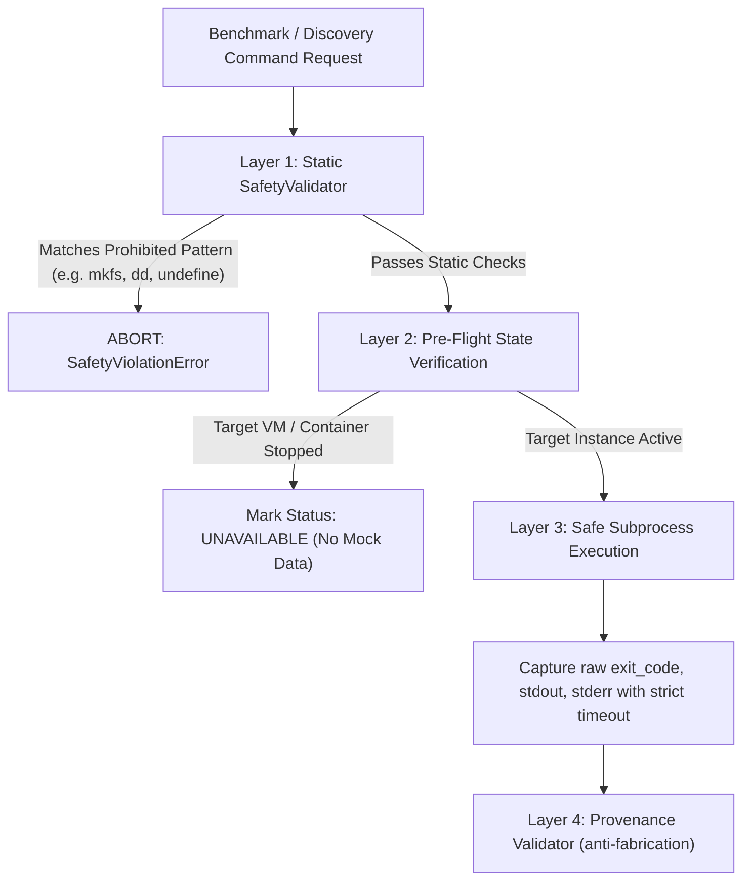

# Safety Specification & Guardrails

## 1. Non-Negotiable Safety Mandate

The CC2 Benchmarking Platform operates under strict non-destructive safety invariants. Under no circumstances may any component of this platform execute operations that endanger host integrity, operating system stability, existing partitions, or guest virtual machines.

> [!CAUTION]
> **Strict Prohibition**: The host system contains active Windows partitions (`nvme0n1p3`, `nvme0n1p4`) and critical EFI boot infrastructure (`nvme0n1p1`). CC2 enforces automated blocking against all destructive system commands.

---

## 2. Absolutely Prohibited Operations

The following operations are categorized as fatal violations and are unconditionally prohibited:

| Prohibited Domain | Explicit Forbidden Actions / Commands | Enforcement Mechanism |
|:---|:---|:---|
| **Disk Partitioning** | `fdisk`, `gdisk`, `parted`, `sfdisk`, `wipefs` | Blocked via `SafetyValidator` regex filter |
| **Filesystem Formatting** | `mkfs`, `mkfs.ext4`, `mkfs.vfat`, `mkfs.ntfs`, `mkfs.btrfs` | Blocked via `SafetyValidator` regex filter |
| **Direct Device Writes** | `dd if=... of=/dev/nvme*`, `dd if=... of=/dev/sd*`, `> /dev/*` | Blocked via block-device write interceptor |
| **Boot & Firmware** | `grub-install`, `update-grub`, `efibootmgr`, firmware flashing | Blocked via command regex filter |
| **Hypervisor Deletion** | `virsh undefine`, `virsh destroy --remove-all-storage`, `VBoxManage unregistervm --delete`, `lxc-destroy` | Blocked via virtualization safety guard |
| **Uninstallation** | `apt remove/purge qemu* libvirt* virtualbox* lxc*` | Zero package uninstallation commands |
| **Destructive Removals** | `rm -rf /`, `rm -rf /boot`, `rm -rf /etc`, `rm -rf /dev` | Blocked via path hierarchy interceptor |
| **Security Disabling** | Disabling AppArmor, SELinux, or kernel mitigations | Never attempted |

---

## 3. Multi-Layer Safety Architecture

CC2 implements defense-in-depth through three protective layers:

### 3.1 Layer 1: The Static Safety Interceptor (`SafetyValidator`)
- Implemented in `collector/common.py`.
- Evaluates every proposed command line string against compiled regular expressions representing prohibited utilities (`mkfs`, `fdisk`, `parted`, `wipefs`, `dd of=/dev/...`, `virsh undefine`, `lxc-destroy`).
- If a dangerous substring or token is detected, execution aborts immediately with a `SafetyViolationError` prior to spawning any process.
- All write operations directed towards `/dev/nvme*`, `/dev/sd*`, or `/dev/vd*` are trapped and rejected.

### 3.2 Layer 2: Pre-Flight Environment Inspection
- Before initiating any benchmark run against a target environment (KVM, VirtualBox, or LXC), the driver queries the actual virtualization daemon:
  - KVM: `virsh -c qemu:///system dominfo <name>`
  - VirtualBox: `VBoxManage list runningvms`
  - LXC: `lxc-ls --fancy`
- If an environment is inactive (e.g., `shut off` or `poweroff`), the platform records `status: unavailable`.
- **Core Rule**: It does NOT attempt destructive reconfigurations, does NOT force guest file tampering, and NEVER substitutes zeros for missing measurements.

### 3.3 Layer 3: Controlled Subprocess Execution
- All system invocations are wrapped in `run_safe_command()`.
- Commands run with explicit timeouts (typically 30–60 seconds) to prevent infinite loops or lockups.
- Standard output and standard error are captured losslessly into isolated streams.

### 3.4 Layer 4: Anti-Fabrication & Provenance Validation
- Monitored by `analysis/validator.py`.
- Verifies that every number appearing in the benchmark report originated from the captured `stdout`.
- Guaranteed zero hardcoded results and zero synthetic demo values.

---

## 4. Graceful Degradation Protocol

If any required dependency or target is absent:
1. **Missing Utilities** (e.g. `fio`, `iperf3`):
   - Gracefully identified during host discovery as `MISSING` / `not_installed`.
   - The platform proceeds with available utilities (`perf`, `gcc`, deterministic C compute kernels) without failing the suite.
2. **Offline Virtual Machines / Containers**:
   - Accurately logged in `results/benchmark_runs.jsonl` with `status: unavailable`.
   - The host baseline remains 100% operational.
   - The UI displays explicit status badges indicating the real state.
