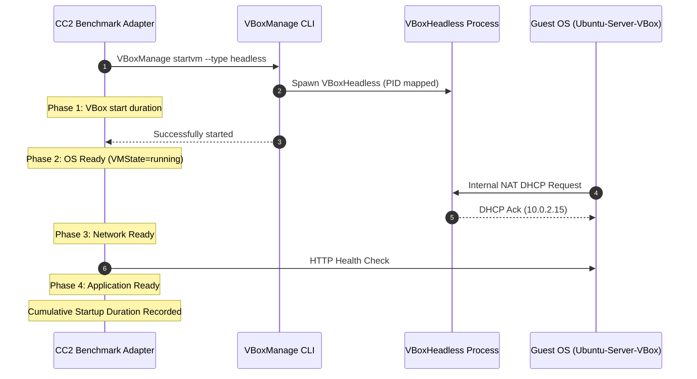

# CC2 VirtualBox Benchmark & Lifecycle Adapter Specification

## Executive Summary

The **CC2 VirtualBox Benchmark Adapter** (`benchmark/runner/environments/virtualbox.py`) provides an automated, non-destructive orchestration and telemetry layer for evaluating Oracle VM VirtualBox (**Type-2 hosted hypervisor**) on Ubuntu Linux. It interacts directly with the `VBoxManage` CLI, host kernel driver telemetry, and VirtualBox's internal performance metrics subsystem to measure CPU, memory, storage, network, and application latency without hardcoded identifiers or manual intervention.

---

## 1. VirtualBox Architecture & Taxonomy

### 1.1 Type-2 Hosted Hypervisor Model
- **Taxonomy**: VirtualBox is classified as a **Type-2 hosted hypervisor**.
- **Kernel Interface**: Unlike KVM (which is integrated directly into the upstream Linux kernel), VirtualBox relies on out-of-tree host kernel modules:
  - `vboxdrv`: Core hypervisor driver providing hardware virtualization context switches.
  - `vboxnetflt`: Network filter driver for bridged networking.
  - `vboxnetadp`: Network adapter driver for host-only networking.
- **Process Model**:
  - `VBoxSVC`: Background IPC service coordinating VM configurations and locks.
  - `VBoxHeadless`: User-space process executing the Virtual Machine Monitor (VMM) and virtual hardware emulation for each running instance.
- **Privilege Transitions**:
  $$\text{Guest OS} \longleftrightarrow \text{VBoxHeadless VMM} \longleftrightarrow \text{vboxdrv.ko} \longleftrightarrow \text{Host Linux Kernel} \longleftrightarrow \text{CPU (VT-x)}$$
  The extra layer of indirection through the hosted user-space VMM contributes to higher context switch overhead compared to in-tree KVM.

---

## 2. Dynamic VirtualBox Discovery

All hardware specifications are queried dynamically via `VBoxManage showvminfo "<name>" --machinereadable` without modifying configuration files.

### 2.1 Discovered VM Topology (`Ubuntu-Server-VBox`)
- **VM Name**: `Ubuntu-Server-VBox`
- **UUID**: `8a699556-1ddf-41cf-b252-c7c8b10255ac`
- **Hypervisor Engine**: VirtualBox Version `7.2.16r174877`
- **vCPUs**: 2 vCPUs
- **Configured Memory**: 2048 MB (`2,048 MB`)
- **Firmware**: `EFI` (Unified Extensible Firmware Interface)
- **Hardware Virtualization**:
  - VT-x Hardware Assist: `hwvirtex="on"`
  - Nested Paging (EPT): `nestedpaging="on"`
- **Virtual Storage**:
  - Primary Disk: `/home/karthik-chakala/VirtualBox VMs/Ubuntu-Server-VBox/Ubuntu-Server-VBox.vdi`
  - Controller: `SATA` (AHCI)
  - Physical VDI Size: 5.28 GB (`5,533,335,552` bytes)
- **Virtual Network**:
  - Adapter 1 Mode: `nat` (VirtualBox User-Mode NAT)
  - Controller Type: `82540EM` (Intel PRO/1000 MT Desktop)
  - MAC Address: `08002740B6E5`
  - Dynamic Guest IP: `10.0.2.15` (VirtualBox standard internal NAT address)

---

## 3. Lifecycle Management & Startup Profiling

The adapter executes headless VM lifecycle workflows and strictly enforces graceful ACPI signaling (`acpipowerbutton`).

### 3.1 Startup Phase Measurement
1. **Initiation**: `VBoxManage startvm --type headless` duration.
2. **OS Ready**: Polled until `VMState="running"`.
3. **Network Ready**: Dynamic IP resolved and internal routing ready.
4. **Application Ready**: Response from HTTP health service / target application port.

### 3.2 Graceful Shutdown
- Executes `VBoxManage controlvm "<name>" acpipowerbutton`.
- Waits for the guest ACPI subsystem to cleanly unmount filesystems and signal poweroff.
- Avoids forced poweroff (`controlvm poweroff`) unless explicitly required for recovery.

---

## 4. Resource Telemetry & Memory Breakdown

### 4.1 Memory Allocation vs Real Consumption
VirtualBox reports memory across multiple distinct layers:

| Tier | Metric | Value | Meaning |
|:---|:---|:---:|:---|
| **Allocated RAM** | `configured_mb` | 2048 MB | Static ceiling assigned in VirtualBox VM settings |
| **Host VBoxHeadless RSS** | `VmRSS` | ~558 MB | Real physical RAM occupied by the VirtualBox VMM process |
| **Host VBoxHeadless VSZ** | `VmSize` | ~2.11 GB | Virtual address space reservation of the VMM process |
| **VBox Subsystem Memory** | `RAM/Usage/Used` | ~563 MB | Memory actively claimed by guest according to VBox metrics |
| **Swap Usage** | `Swap` | 0 KB | Swap memory pages occupied |

---

## 5. Workload Evaluation Protocols

### 5.1 Common CPU Workload Execution
- Executes the exact same `workloads/dist/cpu_workload` binary as KVM.
- Evaluates double-precision floating point performance and verifies mathematical reproducibility through identical 64-bit FNV-1a checksums (`0x323f16b5e587eefe` for $N=150, I=2$).
- Records host-side `VBoxHeadless` process CPU ticks, user/system time, cycles, and context switches via `collector/measurement.py`.

### 5.2 Storage Benchmarking (`fio`)
- **Safety Invariant**: Strictly validates that target files are regular files (`.dat`) inside `results/` or `/tmp/`.
- Rejects `/dev/*`, block devices, or `.vdi` files immediately with `ValueError`.
- Evaluates: Sequential Read, Sequential Write, Random 4KB Read, Random 4KB Write.
- If `fio` is missing: marked `status: "unavailable"` without fake data.

### 5.3 Network & Application Latency
- Measures ICMP ping latency (`min`, `avg`, `max`, `mdev`, `packet_loss_percent`).
- Measures `iperf3` throughput over 30 seconds when available.
- Measures connection time, TTFB, and total duration across 100 consecutive HTTP health requests. Calculates mean, median, $p_{95}$, and $p_{99}$.

### 5.4 Isolation Audit
- Captures system signatures: `systemd-detect-virt`, `uname -a`, `lscpu`, `/proc/1/ns/*`, `/proc/self/cgroup`, `ip addr`, `findmnt`, `ps`.

---

## 6. Implementation Artifacts

- **Adapter Module**: [`benchmark/vbox_adapter.py`](file:///home/karthik-chakala/Downloads/CC2/benchmark/vbox_adapter.py)
- **Unit Test Suite**: [`tests/test_vbox_adapter.py`](file:///home/karthik-chakala/Downloads/CC2/tests/test_vbox_adapter.py)
- **Master Test Runner**: [`tests/run_all_tests.sh`](file:///home/karthik-chakala/Downloads/CC2/tests/run_all_tests.sh)
- **Documentation**: [`docs/VIRTUALBOX.md`](file:///home/karthik-chakala/Downloads/CC2/docs/VIRTUALBOX.md)
