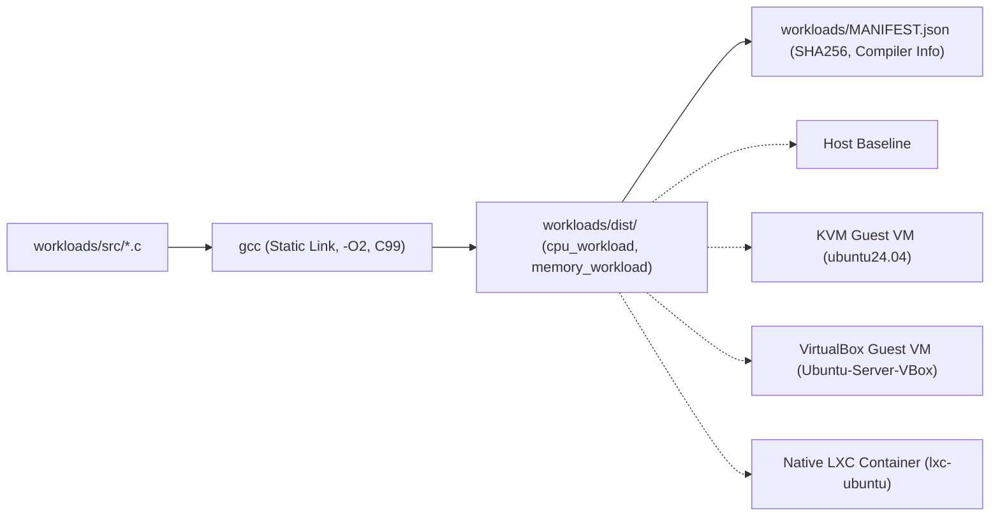

# CC2 Common Workloads Specification & Packaging

## 1. Overview & Portability Philosophy

To evaluate virtualization overhead with scientific rigor, the workload executed inside each target environment (**Host Baseline**, **KVM/QEMU**, **VirtualBox**, and **Native LXC**) must be identical at the binary level. Differences in compiler flags, optimization passes, or dynamic library linkers introduce confounding variables that distort virtualization comparisons.

The CC2 platform resolves this by packaging statically linked C99 binaries compiled with deterministic flags into `workloads/dist/` and cataloging them in `workloads/MANIFEST.json`.



---

## 2. Deterministic CPU Workload (`cpu_workload`)

### 2.1 Implementation & Complexity
- **Source**: `workloads/src/cpu_workload.c`
- **Algorithm**: Double-precision matrix multiplication ($C_{ij} = \sum_k A_{ik} B_{kj}$) coupled with deterministic trigonometric population ($A[i] = \sin(i)$, $B[i] = \cos(i)$).
- **Complexity**: Time complexity $\mathcal{O}(N^3 \times I)$ where $N$ is matrix dimension and $I$ is iteration count.
  $$\text{Total Floating-Point Operations} = 2 \times N^3 \times I$$
  $$\text{GFLOPS} = \frac{\text{Total Operations}}{\Delta t \times 10^9}$$

### 2.2 Anti-Optimization Guarantees
Compilers aggressively optimize or eliminate loops whose outputs appear unobserved. CC2 enforces execution via:
1. **Volatile Memory Barriers**:
   ```c
   #define PREVENT_OPTIMIZATION(ptr) __asm__ __volatile__("" : : "g"(ptr) : "memory")
   ```
2. **Deterministic Checksumming**:
   The entire memory buffer $C$ is processed through a 64-bit FNV-1a hashing function. The resulting hash is printed to stdout and validated across iterations.

### 2.3 Command-Line Parameters
| Flag | Description | Default | Range / Constraints |
|:---|:---|:---:|:---|
| `--size <N>` | Matrix dimension $N \times N$ | 300 | $1 \le N \le 2500$ |
| `--iterations <I>` | Benchmark repetition count | 5 | $1 \le I \le 100$ |
| `--warmup <W>` | Warmup iterations (not timed) | 1 | $0 \le W \le 10$ |
| `--threads <T>` | Worker threads (deterministic row slicing) | 1 | $1 \le T \le 64$ |

### 2.4 Machine-Readable Output Example
```json
{
  "workload": "cpu_deterministic",
  "version": "1.0.0",
  "parameters": {
    "matrix_size": 250,
    "iterations": 3,
    "warmup": 1,
    "threads": 1
  },
  "results": {
    "total_flops": 93750000,
    "warmup_elapsed_sec": 0.008651,
    "elapsed_sec": 0.018207,
    "gflops": 5.1491,
    "checksum": "0xa05074ea2a890136",
    "status": "success"
  }
}
```

---

## 3. Deterministic Memory Workload (`memory_workload`)

### 3.1 Implementation & Memory Access Patterns
- **Source**: `workloads/src/memory_workload.c`
- **Memory Operations**:
  1. **Sequential Write Pass**: Deterministic word generation using 64-bit linear congruential parameters.
  2. **Sequential Read & Accumulate Pass**: Word-by-word streaming read with bitwise XOR accumulation.
  3. **Cache-Busting Stride Pass**: Non-contiguous memory strides (e.g., 64 bytes to span distinct cache lines).
  4. **Repetition**: Repeats the multi-phase cycle for $P$ passes.
  5. **Clean Release**: Invokes `free()` immediately before exit to ensure zero memory leaks.

### 3.2 Host Destabilization Safeguards
To prevent Out-Of-Memory (OOM) killer activation or swap thrashing on the host or guests, `memory_workload` introspects available physical RAM via `sysinfo()` before allocating:
```c
size_t avail_mb = get_available_memory_mb();
if ((size_t)buffer_mb > (avail_mb * 8) / 10) {
    fprintf(stderr, "Requested buffer exceeds 80%% of available RAM. Safety guard abort.\n");
    return 3;
}
```

### 3.3 Command-Line Parameters
| Flag | Description | Default | Range / Constraints |
|:---|:---|:---:|:---|
| `--buffer-mb <N>` | Allocated buffer size in Megabytes | 128 | $1 \le N \le 4096$ (clamped by RAM) |
| `--passes <P>` | Execution passes | 4 | $1 \le P \le 100$ |
| `--stride <S>` | Stride jump size in bytes | 64 | $8 \le S \le 65536$ |

### 3.4 Machine-Readable Output Example
```json
{
  "workload": "memory_deterministic",
  "version": "1.0.0",
  "parameters": {
    "buffer_mb": 64,
    "passes": 3,
    "stride_bytes": 64
  },
  "results": {
    "allocated_bytes": 67108864,
    "transferred_bytes": 402653184,
    "elapsed_sec": 0.112032,
    "throughput_mb_s": 3594.11,
    "checksum": "0x45b1010d67462470",
    "status": "success"
  }
}
```

---

## 4. Workloads Package Manifest (`workloads/MANIFEST.json`)

All distributed binaries are tracked with cryptographic SHA256 hashes generated during the build:

| Binary | Size (Bytes) | SHA256 Hash |
|:---|:---|:---|
| `cpu_workload` | 935,832 | `212853035b582f238058b8d436fecf1f25bd5ff249965c7467336903a563fd9f` |
| `memory_workload` | 785,344 | `1bbf56eae471571293a033c266978f5f63df9ef8dfb0badbae30802b8c28d544` |
| `run_workload.sh` | 954 | `c1e8acb1ccc1b44cea728474669332d6209f1b436fdb72122c0c0385c90ca25f` |

- **Compiler**: `gcc (Ubuntu 13.3.0-6ubuntu2~24.04.1) 13.3.0`
- **Compiler Flags**: `-O2 -Wall -Wextra -pthread -std=c99 -fno-omit-frame-pointer -static`
- **Portability**: Statically linked ELF 64-bit binaries execute across any Linux kernel ($2.6+$) without external dynamic library dependencies.
